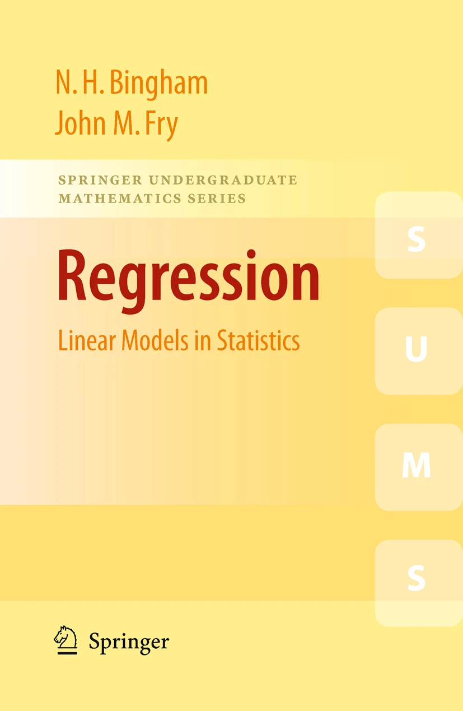
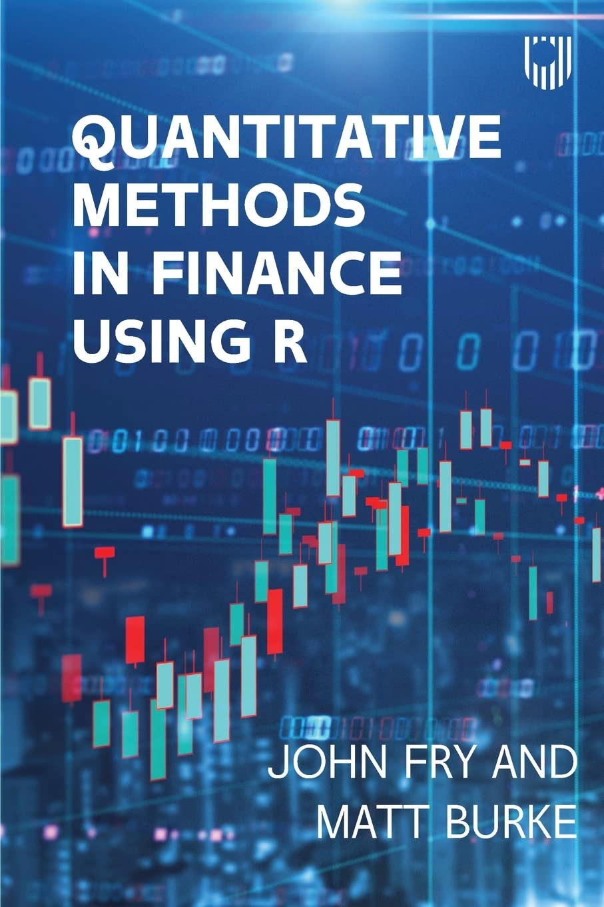

# Welcome 

These are the Slides of the module **Statistical Models 551305** for T2 2025/26 at the University of Hull. 
If you have any question or find any typo, please email me at

::: {.content-visible when-format="html"}

**[S.Fanzon@hull.ac.uk](mailto: S.Fanzon@hull.ac.uk)**

:::

Up to date information about the module will be published on the University of Hull **Canvas Webpage**

::: {.content-visible when-format="html"}

**[canvas.hull.ac.uk/courses/77772](https://canvas.hull.ac.uk/courses/77772)**

:::

and on the **Course Webpage** hosted on my website

::: {.content-visible when-format="html"}

**[silviofanzon.com/blog/2026/Statistical-Models/](https://www.silviofanzon.com/blog/2026/Statistical-Models/)**

:::

# Slides

There are 11 Lectures in this module and 3 optional Appendices. Links to the Slides and Lecture Titles are below.

| **Slides**                                     | **Title**                                       | 
|:------                                         |:------                                          |
| <a href="slides/lecture_1.qmd">Lecture 1</a>   | An introduction to Statistics                   |
| <a href="slides/lecture_2.qmd">Lecture 2</a>   | Random samples & The t-test                     |
| <a href="slides/lecture_3.qmd">Lecture 3</a>   | Introduction to R & The variance ratio test     |
| <a href="slides/lecture_4.qmd">Lecture 4</a>   | Two-sample t-test & More on R                   |
| <a href="slides/lecture_5.qmd">Lecture 5</a>   | Two-sample F-test & Goodness-of-fit test        |
| <a href="slides/lecture_6.qmd">Lecture 6</a>   | Chi-squared test & Least Squares                |
| <a href="slides/lecture_7.qmd">Lecture 7</a>   | The Maths of Regression                         |
| <a href="slides/lecture_8.qmd">Lecture 8</a>   | Practical Regression                            |
| <a href="slides/lecture_9.qmd">Lecture 9</a>   | Model Selection & Regression Assumptions I      |
| <a href="slides/lecture_10.qmd">Lecture 10</a> | Regression Assumptions II & Stepwise Regression |
| <a href="slides/lecture_11.qmd">Lecture 11</a> | ANOVA                                           |
| <a href="slides/appendix_A.qmd">Appendix A</a> | Probability revision                            |
| <a href="slides/appendix_B.qmd">Appendix B</a> | R Style Guide                                   |
| <a href="slides/appendix_C.qmd">Appendix C</a> | Simulation & Bootstrap                          |
: {tbl-colwidths="[30,70]"}

# Statistical tables 

- Download [here](slides/files/Statistics_Tables.pdf)

# R Codes

| **Lecture** | **Codes**                                                                                                                 | 
|:------      |:------                                                                                                                    |
| Lecture 3   | [One-Sample t-test](slides/codes/one_sample_t_test.R)    [Variance ratio test](slides/codes/variance_ratio_test.R)     | 
| Lecture 4   | [Two-Sample t-test](slides/codes/two_sample_t_test.R)                                                                  |
| Lecture 5   | [F-test](slides/codes/F_test.R)   [F-test First Principles](slides/codes/F_test_first_principles.R)   [Goodness-of-fit](slides/codes/good_fit.R)   [Goodness-of-fit First Principles](slides/codes/good_fit_first_principles.R)     [Goodness-of-fit Contingency](slides/codes/good_fit_contingency.R) |
| Lecture 6   | [Independence Test](slides/codes/independence_test.R)   [2008 Crisis](slides/codes/2008_crisis_code.R)   [Least-squares Solution 1](slides/codes/least_squares_1.R)    [Least-squares Solution 2](slides/codes/least_squares_2.R)  |
| Lecture 7   | [Multiple Regression](slides/codes/multiple_regression.R)   [R2 multiple regression](slides/codes/R2_multiple_regression.R)  |
| Lecture 8   | [Simple Regression](slides/codes/simple_regression.R)    [Longley regression](slides/codes/longley_regression.R)             |
| Lecture 9   | [Longley selection](slides/codes/longley_selection.R)   [Galileo](slides/codes/galileo.R)   [Divorces](slides/codes/divorces.R)   [Heteroscedasticity](slides/codes/heteroscedasticity.R)   |
| Lecture 10  | [Autocorrelation](slides/codes/autocorrelation.R)   [Arima](slides/codes/arima.R)   [Multicollinearity](slides/codes/multicollinearity.R)   [Stepwise regression: Longley](slides/codes/longley_stepwise.R)   [Stepwise regression: Divorces](slides/codes/divorces_stepwise.R)  |
| Lecture 11  | [Anova](slides/codes/anova.R)   [Ancova](slides/codes/ancova.R)           |
| Appendix C  | [Monte Carlo $\pi$](slides/codes/monte_carlo_pi.R)   [Bootstrap CI](slides/codes/bootstrap_CI.R)   [Bootstrap t-test](slides/codes/bootstrap_t_test.R)   [Bootstrap F-test](slides/codes/bootstrap_F_test.R)   |
: {tbl-colwidths="[30,70]"}

# Datsets

- [Gold-Stock prices](slides/datasets/gold_stock.txt) 
- [Longley](slides/datasets/longley.txt)
- [Fridge Sales](slides/datasets/fridge_sales.txt)
- [2008 Crisis](slides/datasets/2008_crisis.txt)
- [Family Guy](slides/datasets/family_guy.txt)

# Assessment Breakdown

This module is assessed as follows. Further details are available on Canvas.

| **Type of Assessment** | **Percentage of final grade** |
|:-----------------------|:------------------------------|
| Coursework Portfolio   | 70%                           |
| Homework               | 30%                           |
: {tbl-colwidths="[40,60]"}

# Tasks & Deadlines

The topics for the 10 Homework (HW) assignments and the Coursework (CW) are listed below.  
The homework papers can be downloaded from Canvas.

|**Task**|**Deadline**| **Topics**                                                  |
|:-------|:-----------|:-----------                                                 |
| HW1    | 5 Feb      | MGF. Poisson models for soccer                              |
| HW2    | 12 Feb     | Bivariate transformations. The t-test                       |
| HW3    | 19 Feb     | $\chi^2$ distribution. The t-test in R. Variance ratio test |
| HW4    | 26 Feb     | Two-sample t-test. Welch t-test. Paired t-test              |
| HW5    | 5 Mar      | Two-sample F-test. Goodness-of-fit test                     |
| HW6    | 12 Mar     | $\chi^2$ test of independence. Least Squares                |
| HW7    | 19 Mar     | General linear regression. Segmented models                 |
| HW8    | 26 Mar     | The t-test and F-test for regression                        |
| HW9    | 16 Apr     | Model Selection. Heteroscedasticity                         |
| HW10   | 23 Apr     | Autocorrelation. Multicollinearity                          |
| CW     | 30 Apr     | Entire Module, inc. Stepwise Selection & Anova              | 
: {tbl-colwidths="[10,10,80]"}

# References

**Main textbooks**: These slides are self-contained and largely based on the books

- Bingham and Fry [@bingham-fry]
- Fry and Burke [@fry-burke]

::: {.column width="45%"}
[{width=97.9%}](https://link.springer.com/book/10.1007/978-1-84882-969-5)
:::

::: {.column width="45%"}

:::

**Secondary References**: In addition we reccomend the following

- **Probability & Statistics Manual**: Casella and Berger [@casella-berger]
- **Easier Probability & Statistics Manual**: DeGroot and Schervish [@degroot]
- **Concise Statistics with R**: Dalgaard [@dalgaard]
- **Comprehensive R manual**: Davies [@davies]
