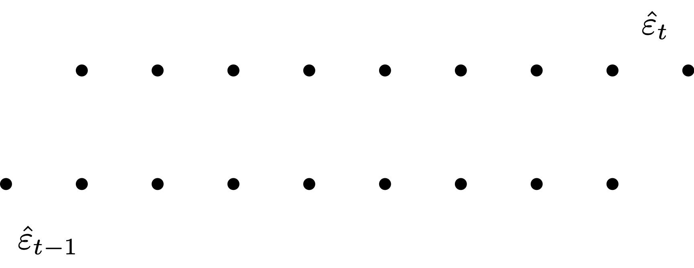
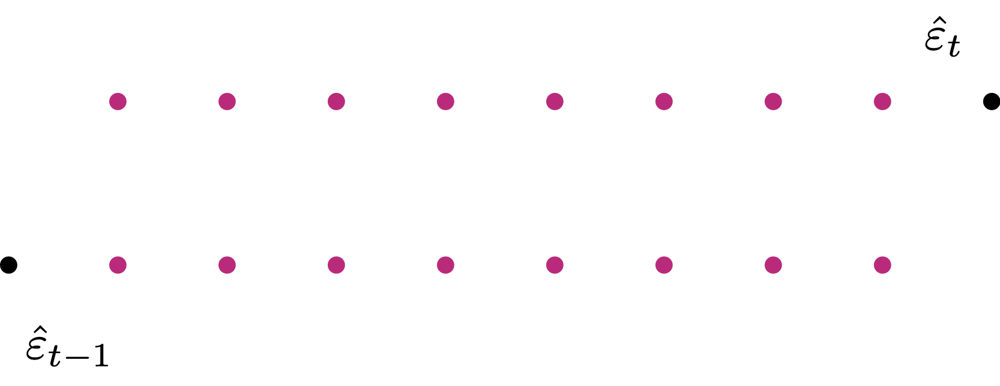
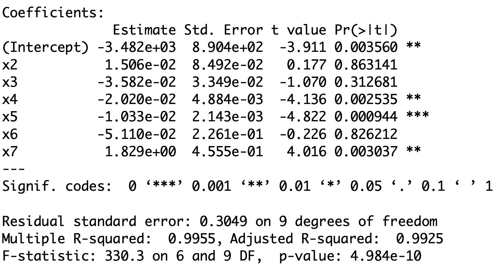

::: {.content-hidden}
$

$
:::


# Lecture 10: <br> Regression <br> Assumptions II  <br> & Stepwise Regression  {background-color="#cc0164" visibility="uncounted"}

::: footer

<div color="#cc0164">  </div>

:::


## Outline of Lecture 10 {.smaller}


1. Reminder: Regeression Assumptions
2. Autocorrelation
3. Multicollinearity
4. Stepwise Regression
5. Stepwise Regression and Overfitting


# Part 1: <br> Reminder: <br> Regression Assumptions <br> {background-color="#cc0164" visibility="uncounted"}

::: footer

<div color="#cc0164">  </div>

:::


## Regression modelling assumptions {.smaller}

In Lecture 7 we have introduced the general linear regression model

$$
Y_i = \beta_1 z_{i1} + \beta_2 z_{i2} + \ldots + \beta_p z_{ip} + \e_i
$$


- There are $p$ predictor random variables

$$
Z_1 \, , \,\, \ldots \, , \, Z_p
$$


- $Y_i$ is the conditional distribution

$$
Y | Z_1 = z_{i1} \,, \,\, \ldots \,, \,\, Z_p = z_{ip}
$$

- The errors $\e_i$ are random variables 


## Regression assumptions on $Y_i$ {.smaller}

1. **Predictor is known:** The values $z_{i1}, \ldots, z_{ip}$ are known

2. **Normality:** The distribution of $Y_i$ is normal

3. **Linear mean:** There are parameters $\beta_1,\ldots,\beta_p$ such that
$$
\Expect[Y_i] = \beta_1 z_{i1} + \ldots + \beta_p z_{ip}  
$$

4. **Homoscedasticity:** There is a parameter $\sigma^2$ such that
$$
\Var[Y_i] = \sigma^2
$$

5. **Independence:** rv $Y_1 , \ldots , Y_n$ are independent, and thus uncorrelated

$$
\Cor (Y_i,Y_j) = 0 \qquad \forall \,\, i \neq j
$$


## Equivalent assumptions on $\e_i$ {.smaller}

1. **Predictor is known:** The values $z_{i1}, \ldots, z_{ip}$ are known

2. **Normality:** The distribution of $\e_i$ is normal

3. **Linear mean:** The errors have zero mean
$$
\Expect[\e_i] = 0
$$

4. **Homoscedasticity:** There is a parameter $\sigma^2$ such that
$$
\Var[\e_i] = \sigma^2
$$

5. **Independence:** Errors $\e_1 , \ldots , \e_n$ are independent, and thus uncorrelated

$$
\Cor (\e_i, \e_j) = 0 \qquad \forall \,\, i \neq j
$$


## Extra assumption on design matrix {.smaller}


6. The design matrix $Z$ is such that

$$
Z^T Z  \, \text{ is invertible}
$$


- Assumptions 1-6 allowed us to estimate the parameters

$$
\beta = (\beta_1, \ldots, \beta_p)
$$

- By maximizing the likelihood, we obtained the MLE

$$
\hat \beta = (Z^T Z)^{-1} Z^T y
$$


## Violation of Regression Assumptions {.smaller}
### We consider 3 scenarios

i. **Heteroscedasticity:** The violation of Assumption 4 of homoscedasticity

$$
\Var [\e_i] \neq \Var[\e_j] \qquad \text{ for some } \,\, i \neq j
$$

ii. **Autocorrelation:** The violation of Assumption 5 of no-correlation

$$
\Cor( \e_i, \e_j ) \neq 0  \qquad \text{ for some } \,\, i \neq j
$$


iii. **Multicollinearity:** The violation of Assumption 6 of invertibilty of the matrix

$$
Z^T Z
$$


# Part 2: <br>Autocorrelation {background-color="#cc0164" visibility="uncounted"}

::: footer

<div color="#cc0164">  </div>

:::


## Autocorrelation {.smaller}

- The general linear regression model is 

$$
Y_i = \beta_1 z_{i1} + \beta_2 z_{i2} + \ldots + \beta_p z_{ip} + \e_i
$$


- Consider Assumption 5
    * **Independence:** Errors $\e_1, \ldots, \e_n$ are independent, and thus uncorrelated
    $$
    \Cor(\e_i , \e_j) = 0 \qquad \forall \,\, i \neq j
    $$

- **Autocorrelation:** The violation of Assumption 5

$$
\Cor(\e_i , \e_j) = 0 \qquad \text{ for some } \,\, i \neq j
$$


## Why is independence important? {.smaller}

- Recall the methods to assess linear models 

    * Coefficient $R^2$
    * $t$-tests for parameters significance
    * $F$-test for model selection

- The above methods **rely heavily** on independence


## Why is independence important? {.smaller}

- Once again, let us consider the likelihood calculation
    \begin{align*}
    L & = f(y_1, \ldots, y_n) =  \prod_{i=1}^n  f_{Y_i} (y_i)  
         \\[15pts]
      & = \frac{1}{(2\pi \sigma^2)^{n/2}} \, \exp   \left(   -\frac{\sum_{i=1}^n(y_i- \hat y_i)^2}{2\sigma^2}      \right) \\[15pts]
      & = \frac{1}{(2\pi \sigma^2)^{n/2}} \, \exp   \left(   -\frac{ \RSS }{2\sigma^2}      \right)
    \end{align*}


- The second equality is only possible thanks to independence of 

$$
Y_1 , \ldots, Y_n
$$


## Why is independence important? {.smaller}

- If we have **autocorrelation** then

$$
\Cor (\e_i,\e_j) \neq 0 \quad \text{ for some } \, i \neq j
$$

- In particualar we would have

$$
\e_i \, \text{ and } \, \e_j \, \text{ dependent } \quad \implies \quad Y_i \, \text{ and } \, Y_j \, \text{ dependent }
$$


- Therefore the calculation in previous slide breaks down

$$
L \neq \frac{1}{(2\pi \sigma^2)^{n/2}} \, \exp   \left(   -\frac{ \RSS }{2\sigma^2}      \right)
$$


## Why is independence important? {.smaller}

- In this case $\hat \beta$ does no longer maximize the likelihood!

- As already seen, this implies that 

$$
\ese (\beta_j) \,\, \text{ is unreliable}
$$

- **Without independence, the regression maths does not work!**
    * t-tests for significance of $\beta_j$
    * confidence intervals for $\beta_j$
    * $F$-tests for Model Selection
    * They all break down and become unreliable!


## Causes of Autocorrelation {.smaller}
### Time-series data

- Autocorrelation means that

$$
\Cor (\e_i,\e_j) \neq 0 \quad \text{ for some } \, i \neq j
$$

- Autocorrelation if often unavoidable

- Typically associated with **time series data**
    * Observations ordered wrt time or space are usually correlated
    * This is because observations taken close together may take similar values


## Example: Financial data {.smaller}

- Autocorrelation is especially likely for datasets in 
    * Accounting
    * Finance
    * Economics

- Autocorrelation is likely if the data have been recorded over time
    * E.g. daily, weekly, monthly, quarterly, yearly

- Example: Datasetet on *Stock prices* and *Gold prices*
    * General linear regression model assumes uncorrelated errors
    * Not realistic to assume that price observations for say 2020 and 2021 would be independent


## Causes of Autocorrelation  {.smaller}
### Inertia

- Economic time series tend to exhibit **cyclical behaviour**

- Examples: GNP, price indices, production figures, employment statistics etc.

- These series tend to be quite slow moving
    * Effect of inertia is that successive observations are highly correlated

**This is an extremely common phenomenon in financial and economic time series**


## Causes of Autocorrelation  {.smaller}
### Cobweb Phenomenon

- Characteristic of industries in which a large amount of time passes between
    * the decision to produce something 
    * and its arrival on the market

- Cobweb phenomenon is common with agricultural commodities

- Economic agents (e.g. farmers) decide
    * how many goods to supply to the market
    * based on previous year price 


## Causes of Autocorrelation  {.smaller}
### Cobweb Phenomenon

- **Example:** the amount of crops farmers supply to the market at time $t$ might be

\begin{equation} \tag{3}
{\rm Supply}_t = \beta_1 + \beta_2 \, {\rm Price}_{t-1} + \e_t
\end{equation}

- Errors $\e_t$ in equation (3) are unlikely to be completely random and patternless

- This is because 
    1. They represent actions of intelligent economic agents (e.g. farmers)
    2. Price from previous year influences supply for current year

**Error terms are likely to be autocorrelated**


## Causes of Autocorrelation  {.smaller}
### Data manipulation


**Examples:** 

- Quarterly data may smooth out the wild fluctuations in monthly sales figures

- Low frequency economic survey data may be interpolated

**However:** Such data transformations may be inevitable

- In social sciences data quality may be variable

- This may induce systematic patterns and autocorrelation
    

**No magic solution -- Autocorrelation is unavoidable and must be considered**


## How to detect Autocorrelation {.smaller}

Autocorrelation is often unavoidable. We should be able to detect it:

1. Graphical methods
    * Simple, robust and informative

2. Statistical tests
    * Runs test
    * Durbin-Watson test


**Graphical and statistical methods can be useful cross-check of each other!**


## Graphical methods for Autocorrelation {.smaller}

1. Time-series plot of residuals:
    * Plot residuals $\hat{\e}_t$ over time

2. Autocorrelation plot of residuals:
    * Plot residuals $\hat{\e}_t$ against lagged residuals $\hat{\e}_{t-1}$


Check to see if any evidence of a systematic pattern exists:

- No Autocorrelation: Plots will look **random**
- Yes Autocorrelation: Plots will show certain **patterns**


## Example: Stock Vs Gold prices {.smaller}

- Code for this example is available here [autocorrelation.R](codes/autocorrelation.R)

- Stock Vs Gold prices data is available here [gold_stock.txt](datasets/gold_stock.txt)

- Read data into R and fit simple regression

```r
# Load dataset
prices <- read.table(file = "gold_stock.txt",
                    header = TRUE)

# Store data-frame into 2 vectors
stock.price <- prices$stock_price
gold.price <- prices$gold_price

# Fit regression model
model <- lm(gold.price ~ stock.price)
```


##  {.smaller}

::: {style="font-size: 0.94em"}

**Time-series plot of residuals:** Plot the residuals $\hat{\e}_i$

- Time series plot suggests some evidence for autocorrelation
- Look for successive *runs* of residuals either side of line $y = 0 \,$ (see $t = 15$)

:::


::::: {.columns style='display: flex !important; height: 60%;'}

::: {.column width="38%" style='display: flex; justify-content: center; align-items: center;'}

```r
# Compute residuals
residuals <- model$resid

# Time-series plot of residuals
plot(residuals,
     xlab = "Time", 
     ylab = "Residuals",
     pch = 16,
     cex = 2)

# Add line y = 0 for reference
abline(0, 0, col = "red", lwd = 4)
```

:::

::: {.column width="61%" style='display: flex; justify-content: center; align-items: center;'}

```{r}
#| echo: false
#| fig-asp: 1

# Read the data
prices <- read.table(file = "datasets/gold_stock.txt",
                   header = TRUE
                  )

stock.price <- prices$stock_price
gold.price <- prices$gold_price

# Fit regression model
model <- lm(gold.price ~ stock.price)

# Compute residuals
residuals <- model$resid

# Time-series plot of residuals
plot(residuals, 
     xlab = "", 
     ylab= "",
     pch = 16,
     cex = 2)

# Add labels
mtext("Time", side=1, line=3, cex=2.1)
mtext("Residuals", side=2, line=2.5, cex=2.1)

# Add line y = 0 for reference
abline(0, 0, col = "red", lwd = 4)
```

:::
:::::


## {.smaller}


::::: {.columns style='display: flex !important; height: 90%;'}

::: {.column width="27%" style='display: flex; align-items: center;'}

::: {style="font-size: 0.94em"}

**Autocorrelation plot of residuals:**

- Want to plot $\hat{\e}_t$ against $\hat{\e}_{t-1}$
- Shift $\hat{\e}_t$ by 1 to get $\hat{\e}_{t-1}$
- Can only plot magenta pairs
- We have 1 pair less than the actual number of residuals

:::


:::

::: {.column width="72%" style='display: flex; justify-content: center; align-items: center;'}

{width=110%}
{width=110%}

:::
:::::


##  {.smaller}


- We want to plot $\hat{\e}_t$ against $\hat{\e}_{t-1}$
    * Residuals $\hat{\e}_t$ are stored in vector $\,\, \texttt{residuals}$
    * We need to create a shifted version of $\,\, \texttt{residuals}$
    * First compute the length of $\,\, \texttt{residuals}$

```r
# Compute length of residuals
length(residuals)
```
```{r}
# Read the data
prices <- read.table(file = "datasets/gold_stock.txt",
                   header = TRUE
                  )

stock.price <- prices$stock_price
gold.price <- prices$gold_price

# Fit regression model
model <- lm(gold.price ~ stock.price)

# Compute residuals
residuals <- model$resid

# Compute length of residuals
length(residuals)
```


- Need to generate the $33-1$ pairs for plotting


##  {.smaller}


- **Lag 0:** 
    * This is the original vector with no lag
    * Lose one observation from $\,\, \texttt{residuals}$ -- the first observation

```r 
residuals.lag.0 <- residuals[2:33]
```


- **Lag 1:** 
    * This is the original vector, shifted by 1
    * Lose one observation from $\,\, \texttt{residuals}$ -- the last observation

```r 
residuals.lag.1 <- residuals[1:32]
```


##  {.smaller}

::: {style="font-size: 0.94em"}

**Autocorrelation plot of residuals:** Plot $\hat{\e}_t$ against $\hat{\e}_{t-1}$

- Plot suggests positive autocorrelation of residuals
- This means $\, \hat{\e}_t \, \approx \, a + b \, \hat{\e}_{t-1} \,$ with $b > 0$ 
    
:::

::::: {.columns style='display: flex !important; height: 60%;'}

::: {.column width="38%" style='display: flex; justify-content: center; align-items: center;'}

```r
# Plot Lag0 against Lag1 residuals

plot(residuals.lag.1, 
     residuals.lag.0,
     xlab = "Residuals Lag 1", 
     ylab = "Residuals Lag 0",
     pch = 16,
     cex = 2)
```

:::

::: {.column width="61%" style='display: flex; justify-content: center; align-items: center;'}

```{r}
#| echo: false
#| fig-asp: 1

# Read the data
prices <- read.table(file = "datasets/gold_stock.txt",
                   header = TRUE
                  )

stock.price <- prices$stock_price
gold.price <- prices$gold_price

# Fit regression model
model <- lm(gold.price ~ stock.price)

# Compute residuals
residuals <- model$resid

# Generate lagged version of residuals
residuals.lag.0 <- residuals[2:33]
residuals.lag.1 <-residuals[1:32]

# Plot Lag0 against Lag 1 residuals
plot(residuals.lag.1, 
     residuals.lag.0,
     xlab = "", 
     ylab= "",
     pch = 16,
     cex = 2)

# Add labels
mtext("Residuals Lag 1", side=1, line=3, cex=2.1)
mtext("Residuals Lag 0", side=2, line=2.5, cex=2.1)
```

:::
:::::


## {.smaller}

**Conclusions:** The dataset Gold Price vs Stock Price exhibits Autocorrelation

- Autocorrelation was detected by both graphical methods:
    * Time-series of residuals
    * Autocorrelation plot of residuals


- This was expected, given that the dataset represents a time-series of prices


## Statistical tests for Autocorrelation {.smaller}

- Runs test:
    * If Regression Assumptions are satisfied, the residuals are $\e_i \sim N(0,\sigma^2)$
    * This means residuals $\hat{\e}_i$ are equally likely to be positive or negative
    * The runs test uses this observation to formulate a test for autocorrelation


- Durbin-Watson test:
    * Test to see if residuals are AR(1) - Auto-regressive of order 1
    * This means testing if there exists a linear relation of the form
    $$
    \hat{\e}_t = a + b \hat{\e}_{t-1} + u_t
    $$
    where $u_t \sim N(0,\sigma^2)$ is an error term
 

**We do not cover these tests**


## What to do in case of Autocorrelation? {.smaller}

- Consider the simple regression model

$$
Y_i = \alpha + \beta x_i + \e_i
$$

- Suppose that autocorrelation occurs

$$
\Cor (\hat{\e}_i, \hat{\e}_j ) \neq 0 \quad \text{ for some } \, i \neq j
$$

- Also, suppose that autocorrelation is Auto-Regressive of Order 1

$$
\hat{\e}_t = a + b \, \hat{\e}_{t-1} + u_t \,, \qquad
u_t \,\, \text{ iid } \,\, N(0,\sigma^2)
$$

- Example: This is the case for dataset *Stock prices* Vs *Gold prices*


##  {.smaller}

- In this case, predictions from the simple linear model are not reliable

$$
Y_i = \alpha + \beta x_i + \e_i
$$


- Instead, substitute into the model the relation $\hat{\e}_t = a + b \, \hat{\e}_{t-1} + u_t$

- We obtain the new linear model (up to relabelling coefficients)

$$
Y_t = \alpha + \beta x_t + \phi \hat{\e}_{t-1} + u_t  \,, \qquad
u_t \,\, \text{ iid } \,\, N(0,\sigma^2)
$$

- The above is an **Autoregressive linear Model** of order 1  
(because time $t-1$ influences time $t$)
    * These models couple regression with time-series analysis (ARIMA models)
    * Good reference is book by Shumway and Stoffer [@shumway]


## ARIMA Model in R {.smaller}

- Suppose we want to fit the model

$$
Y = \beta_1 z_1 + \beta_2 z_2 + \ldots +  \beta_n z_n + \e_i
$$

- However, suppose the residuals exhibit autocorrelation 

- In this case, ordinary least squares assumptions are violated

- In this case, instead of regression, we need to use ARIMA models:
    * ARIMA combines regression with a time series structure in the residuals


## ARIMA Model in R {.smaller}

- Suppose we want to fit the model

$$
Y = \beta_1 z_1 + \beta_2 z_2 + \ldots +  \beta_n z_n + \e_i
$$

- This is fitted in R as follows:

```r
arima(y, xreg = cbind(z1, z2, ..., zn), order = c(p, d, q))
```

::: {style="font-size: 0.5em"}

<br>

:::

- ``y`` is the given data vector; `z1, ..., zn` the given predictors
- `xreg` specifies the regressors included in the model
- `order` specifies the ARIMA$(p, d, q)$ component
- In our case we will use
`order = c(1, 0, 0)` 
- This corresponds to an Autoregressive Model of order 1 -- abbreviated **AR(1)**


## Example: ARIMA for Stock Vs Gold prices {.smaller}

- Code for this example is available here [arima.R](codes/arima.R)

- Stock Vs Gold prices data is available here [gold_stock.txt](datasets/gold_stock.txt)

- We want to fit the regression model

$$
\texttt{gold.price} =  \alpha + \beta \times (\texttt{stock.price}) + \e
$$

- We already saw that residuals are autocorrelated

- Therefore we fit ARIMA model of order 1 -- Abbreviated in **AR(1)**

```r
# Load and save data
prices <- read.table(file = "gold_stock.txt", header = TRUE)
stock.price <- prices$stock_price
gold.price <- prices$gold_price

# Fit AR(1) model
arima(gold.price, xreg = stock.price, order = c(1,0,0))
```


## {.smaller}

::: {style="font-size: 0.9em"}

**Output:**

```verbatim
Coefficients:
         ar1  intercept  stock.price
      0.5578     3.9406      -0.0487
s.e.  0.1545     0.5675       0.0247
```


::: {style="font-size: 0.5em"}

<br>

:::


- The fitted AR(1) model is

\begin{align*}
(\texttt{gold.price})_t & = \alpha + \beta \times (\texttt{stock.price})_t + \e_t \\[1.0em]
\e_t & = \phi \e_{t-1} + u_t \,, \qquad
u_t \,\, \text{ iid } \,\, N(0,\sigma^2)
\end{align*}

- The output gives us estimates and $\ese$ for the 3 parameters:

| Variable       | Parameter  | Value   |  $\ese$ |
|----------------|-----------:|---------:|-----------:|      
| `ar1`          | $\phi$       | 0.5578  |0.1545  |
| `intercept`    | $\alpha$       | 3.9406  | 0.5675 |  
| `stock.price`  | $\beta$      | -0.0487 | 0.0247 |


:::


## {.smaller}

::: {style="font-size: 0.9em"}

**Output:**

```verbatim
Coefficients:
         ar1  intercept  stock.price
      0.5578     3.9406      -0.0487
s.e.  0.1545     0.5675       0.0247
```


::: {style="font-size: 0.5em"}

<br>

:::

- We need to check if the 3 parameters $\phi,\alpha,\beta$ are significant

- In order to do that, we need to compute the three t-statistics:

$$
t = \frac{\text{parameter}}{\ese}  \sim  t_{\rm df}
$$

- From these we can compute the corresponding p-values

$$
p = 2 P(t_{\rm df} > |t|)
$$

:::


## {.smaller}

::: {style="font-size: 0.9em"}

**Output:**

```verbatim
Coefficients:
         ar1  intercept  stock.price
      0.5578     3.9406      -0.0487
s.e.  0.1545     0.5675       0.0247
```


::: {style="font-size: 0.5em"}

<br>

:::


- The dataset contains $33$ data points, as seen by using:

```r
length(gold.price)
```

```{r}
# Load and save data
prices <- read.table(file = "datasets/gold_stock.txt", header = TRUE)
stock.price <- prices$stock_price
gold.price <- prices$gold_price

length(gold.price)
```

- There are 3 estimated parameters ($\phi,\alpha,\beta$)


- Therefore, the degrees of freedom are 

$$
{\rm df} = 33-3 = 30
$$

:::


## {.smaller}

::: {style="font-size: 0.9em"}

**Output:**

```verbatim
Coefficients:
         ar1  intercept  stock.price
      0.5578     3.9406      -0.0487
s.e.  0.1545     0.5675       0.0247
```


::: {style="font-size: 0.5em"}

<br>

:::


- The coefficients and the corresponding $\ese$ are given in the output:

```r
coeff <- c(0.5578, 3.9406, -0.0487)
ese <- c(0.1545, 0.5675, 0.0247)
```

::: {style="font-size: 0.5em"}

<br>

:::

- Therefore, the three t-statistics can be computed by


```r
t <- coeff / ese
```

```{r}
coeff <- c(0.5578, 3.9406, -0.0487)
ese <-c (0.1545, 0.5675, 0.0247)

t <- coeff / ese
cat(t)
```

::: {style="font-size: 0.5em"}

<br>

:::

- Then, the p-values are:

```r
p.value <- 2 * (1 - pt(abs(t), df))
```

```{r}
coeff <- c(0.5578, 3.9406, -0.0487)
ese <-c (0.1545, 0.5675, 0.0247)

t <- coeff / ese
p.value <- 2 * (1 - pt(abs(t), 30))
cat(p.value)
```


:::


## {.smaller}

::: {style="font-size: 0.9em"}

**Conclusion:** We fitted the AR(1) model:

\begin{align*}
(\texttt{gold.price})_t & = \alpha + \beta \times (\texttt{stock.price})_t + \e_t \\[1.0em]
\e_t & = \phi \e_{t-1} + u_t \,, \qquad
u_t \,\, \text{ iid } \,\, N(0,\sigma^2)
\end{align*}

- The estimates and p-values for the 3 parameters are:

| Parameter | $\phi$  | $\alpha$| $\beta$ |
|:---------|---------:|---------:|---------:|
|Estimate  |0.5578   |  3.9406    |  -0.0487 |
| p-value   |   0.001100235  |  1.032974e-07 | 0.05793185 |

::: {style="font-size: 0.5em"}

<br>

:::

- The p-value for $\phi$ is significant: $\,\, p=0.001100235 < 0.05$

- This shows the residuals are actually autocorrelated, with relationship

$$
\e_t = (0.001100235) \times  \e_{t-1} + u_t 
$$

- Autocorrelation makes the link between real gold and stock prices harder to establish

:::


## {.smaller}

::: {style="font-size: 0.9em"}

**Conclusion:** We fitted the AR(1) model:

\begin{align*}
(\texttt{gold.price})_t & = \alpha + \beta \times (\texttt{stock.price})_t + \e_t \\[1.0em]
\e_t & = \phi \e_{t-1} + u_t \,, \qquad
u_t \,\, \text{ iid } \,\, N(0,\sigma^2)
\end{align*}

- The estimates and p-values for the 3 parameters are:

| Parameter | $\phi$  | $\alpha$| $\beta$ |
|:---------|---------:|---------:|---------:|
|Estimate  |0.5578   |  3.9406    |  -0.0487 |
| p-value   |   0.001100235  |  1.032974e-07 | 0.05793185 |

::: {style="font-size: 0.5em"}

<br>

:::


- The p-value for $\beta$ is not significant: $\,\, p=0.05793185 > 0.05$

- However $p<0.01$, giving weak evidence of a relationship between stock and gold price

- This means we can make predictions using the linear model

$$
\texttt{gold.price}  = 3.9406 - 0.0487  \times (\texttt{stock.price}) 
$$

:::


## {.smaller}

::: {style="font-size: 0.9em"}

**Conclusion:** Fitting the AR(1) model gives the relationship

\begin{equation}
\texttt{gold.price}  = 3.9406 - 0.0487  \times (\texttt{stock.price}) 
\end{equation}

::: {style="font-size: 0.5em"}

<br>

:::

- Using ordinary least squares, we instead would obtain the estimates:

```r
lm(gold.price ~ stock.price)
```

```verbatim
Coefficients:
(Intercept)  stock.price  
    4.21285     -0.06409 
```

::: {style="font-size: 0.5em"}

<br>

:::

- This gives the regression line

$$
\texttt{gold.price}  = 4.21285 - 0.06409  \times (\texttt{stock.price}) 
$$

- However, OLS ignores autocorrelation in the residuals

**Therefore the AR(1) estimate in (1) is preferred**

:::


## Warning {.smaller}


- Consider again the linear model

$$
y_t = \alpha + \beta x_t + \e_t
$$

- The AR(1) model assumes the residuals form a **stationary** time series

- A time series is stationary if its behavior is consistent over time

- Specifically, two properties should remain roughly constant:
	1.	Mean – the average level does not drift
	2.	Variance – the amount of fluctuation remains stable


## Example {.smaller}

```{r}
# Set seed for reproducibility
set.seed(123)

# -------------------------
# 1. Stationary Time Series
# -------------------------
# Generate stationary series: mean 0, constant variance
stationary_ts <- rnorm(300, mean = 0, sd = 5)

# Plot
par(mfrow = c(3,1))  # 3 plots stacked vertically

plot(stationary_ts, type = "l", col = "black",
     main = "Stationary Time Series",
     xlab = "Index", ylab = "Observation")

# ------------------------------------------
# 2. Non-Stationary Time Series (Time-Dependent Mean)
# ------------------------------------------
# Generate non-stationary series: random walk (mean changes over time)
nonstationary_mean_ts <- cumsum(rnorm(300, mean = 1, sd = 5))

plot(nonstationary_mean_ts, type = "l", col = "black",
     main = "Non–Stationary Time Series (Time–Dependent Mean)",
     xlab = "Index", ylab = "Observation")

# ------------------------------------------
# 3. Non-Stationary Time Series (Time-Dependent Variance)
# ------------------------------------------
# Generate non-stationary series: variance increases over time
t <- 1:300
nonstationary_var_ts <- rnorm(300, mean = 0, sd = t*0.1)  # variance increases

plot(nonstationary_var_ts, type = "l", col = "black",
     main = "Non–Stationary Time Series (Time–Dependent Variance)",
     xlab = "Index", ylab = "Observation")
```


## Example: Gold vs Stock prices {.smaller}

::: {style="font-size: 0.94em"}

For example, let us examine the residuals $\e_t$ from the ordinary linear model:

$$
\texttt{gold.price} = \alpha + \beta \times \texttt{stock.price} + \e_t
$$

    
:::

::::: {.columns style='display: flex !important; height: 55%;'}

::: {.column width="38%" style='display: flex; justify-content: center; align-items: center;'}

```r
# Fit linear model
mod <- lm(gold.price ~ stock.price)

# Plot the residuals
plot(mod$resid)
```


:::

::: {.column width="50%" style='display: flex; justify-content: center; align-items: center;'}

```{r}
#| echo: false
#| fig-asp: 0.7

# Load and save data
prices <- read.table(file = "datasets/gold_stock.txt", header = TRUE)
stock.price <- prices$stock_price
gold.price <- prices$gold_price

# Fit regression model
model <- lm(gold.price ~ stock.price)

plot(model$resid, 
     pch = 16,
     cex = 2)
```

:::

:::::

::: {style="font-size: 0.94em"}
- The residuals form a time series that looks stationary

- That makes sense -- We were able to fit the AR(1) model without issues
:::


## Example: Gold vs Stock prices {.smaller}

::: {style="font-size: 0.94em"}

Now, let us examine the residuals $\e_t$ from the OLS regression with the variables swapped:

$$
\texttt{stock.price} = \alpha + \beta \times \texttt{gold.price} + \e_t
$$

    
:::

::::: {.columns style='display: flex !important; height: 55%;'}

::: {.column width="38%" style='display: flex; justify-content: center; align-items: center;'}

```r
# Fit linear model
mod <- lm(stock.price ~ gold.price)

# Plot the residuals
plot(mod$resid)
```


:::

::: {.column width="50%" style='display: flex; justify-content: center; align-items: center;'}

```{r}
#| echo: false
#| fig-asp: 0.7

# Load and save data
prices <- read.table(file = "datasets/gold_stock.txt", header = TRUE)
stock.price <- prices$stock_price
gold.price <- prices$gold_price

# Fit regression model
model <- lm(stock.price ~ gold.price)

plot(model$resid, 
     pch = 16,
     cex = 2)
```

:::

:::::

::: {style="font-size: 0.94em"}
- The residuals show an upward trend: the series is not stationary

- Consequently, fitting an AR(1) model will likely encounter problems
:::


## Example: Gold vs Stock prices {.smaller}

::: {style="font-size: 0.94em"}

- To investigate, we attempt to fit an AR(1) model to the linear regression:

$$
\texttt{stock.price} = \alpha + \beta \times \texttt{gold.price} + \e_t
$$


- In R, we try to fit AR(1) with the command:

::: {style="font-size: 0.5em"}

<br>

:::

```r
arima(stock.price, xreg = gold.price, order = c(1,0,0))
```

```verbatim
Error in arima(stock.price, xreg = gold.price, order = c(1, 0, 0)) : 
  non-stationary AR part from CSS
```

::: {style="font-size: 0.5em"}

<br>

:::

- As expected, we get an error because the residuals $\e_t$ are not stationary

- This happens because the residuals $\e_t$ are not **stationary**

:::


## Possible Remedy for Non-Stationarity {.smaller}

::: {style="font-size: 0.90em"}

**Differencing:** common technique to make a time series stationary by eliminating trends

- The R command `diff(x)` computes the difference between consecutive observations:  

$$
\text{diff}(x)_t = x_t - x_{t-1}
$$

- This transforms a non-stationary series into a stationary one, to which we can apply AR(1)

::: {style="font-size: 0.5em"}

<br>

:::

```r
# Fit AR(1) on differenced series
arima(diff(stock.price), xreg = diff(gold.price), order = c(1, 0, 0))
```

```verbatim
Coefficients:
         ar1  intercept  diff(gold.price)
      0.5141     1.0442            0.1632
s.e.  0.1510     0.7342            0.3879
```

::: {style="font-size: 0.5em"}

<br>

:::

**Warning:** AR(1) is fitted on differences $\implies$ coefficients not valid for original series


:::


::: {.content-hidden}

Do next time

- Statistical tests for autocorrelation: You can do
both Runs test and Durbin Watson. It is not clear what d_L is in Durbin Watson: ask John

- This is Lecture 9 John Fry slides Section 4 onwards

:::


# Part 3: <br>Multicollinearity {background-color="#cc0164" visibility="uncounted"}

::: footer

<div color="#cc0164">  </div>

:::


## Multicollinearity {.smaller}

- The general linear regression model is 

$$
Y_i = \beta_1 z_{i1} + \beta_2 z_{i2} + \ldots + \beta_p z_{ip} + \e_i
$$


- Consider Assumption 6
    * The design matrix $Z$ is such that
    $$
    Z^T Z  \, \text{ is invertible}
    $$

- **Multicollinearity:** The violation of Assumption 6

$$
\det(Z^T Z ) \, \approx  \, 0  \, \quad \implies \quad Z^T Z \, \text{ is (almost) not invertible}
$$


## Causes of Multicollinearity {.smaller}

$$ 
\text{Multicollinearity = multiple (linear) relationships between the Z-variables}
$$


- Multicollinearity arises when there is either 
    * **exact** linear relationship amongst the $Z$-variables
    * **approximate** linear relationship amongst the $Z$-variables

<br>

**$Z$-variables *inter-related*** $\quad \implies \quad$ **hard to isolate individual influence on $Y$**


## Example of Multicollinear data {.smaller}


::::: {.columns style='display: flex !important; height: 90%;'}

::: {.column width="72%" style='display: flex; justify-content: center; align-items: center;'}


::: {style="font-size: 0.95em"}

- Exact collinearity for $Z_1$ and $Z_2$
    * because of exact linear relation
    $$
    Z_2 = 5 Z_1
    $$

- Approximate collinearity for $Z_1$ and $Z_3$
    * because $Z_3$ is small perturbation of $Z_2$
    $$
    Z_3 \approx Z_2
    $$

:::

:::

::: {.column width="28%" style='display: flex; justify-content: center; align-items: center;'}


|  $Z_1$| $Z_2$ |       $Z_3$|
|-------|-------|------------|
|  10   |   50  |      52    |
|  15   |   75  |      75    |
|  18   |   90  |      97    |
|  24   |  120  |     129    |
|  30   |  150  |     152    |


:::
:::::


## Example of Multicollinear data {.smaller}

::::: {.columns style='display: flex !important; height: 90%;'}

::: {.column width="72%" style='display: flex; justify-content: center; align-items: center;'}

::: {style="font-size: 0.92em"}

- Approximate collinearity for $Z_3$ and $Z_1$
    $$
    Z_3 \approx 5 Z_1
    $$

- **All instances qualify as multicollinearity**

:::

:::

::: {.column width="28%" style='display: flex; justify-content: center; align-items: center;'}


|  $Z_1$| $Z_2$ |       $Z_3$|
|-------|-------|------------|
|  10   |   50  |      52    |
|  15   |   75  |      75    |
|  18   |   90  |      97    |
|  24   |  120  |     129    |
|  30   |  150  |     152    |


:::
:::::


## Example of Multicollinear data {.smaller}

::::: {.columns style='display: flex !important; height: 90%;'}

::: {.column width="72%" style='display: flex; justify-content: center; align-items: center;'}

::: {style="font-size: 0.92em"}

- Since these relations are present, correlation is high

```{r}
#| echo: true

# Enter the data
Z1 <- c(10, 15, 18, 24, 30)
Z2 <- c(50, 75, 90, 120, 150)
Z3 <- c(52, 75, 97, 129, 152)

# Z1 and Z3 are approx correlated
cor(Z1, Z3)

# Z1 and Z2 are exactly correlated
cor(Z1, Z2)

# Z2 and Z3 are approx correlated
cor(Z2, Z3)
```

:::

:::

::: {.column width="28%" style='display: flex; justify-content: center; align-items: center;'}


|  $Z_1$| $Z_2$ |       $Z_3$|
|-------|-------|------------|
|  10   |   50  |      52    |
|  15   |   75  |      75    |
|  18   |   90  |      97    |
|  24   |  120  |     129    |
|  30   |  150  |     152    |


:::
:::::


## Consequences of Multicollinearity {.smaller}

::: {style="font-size: 0.95em"}

- Therefore, multicollinearity means that
    * Predictors $Z_j$ are (approximately) linearly dependent
    * E.g. one can be written as (approximate) linear combination of the others


- Recall that the design matrix is

$$
Z
= (Z_1 | Z_2 | \ldots | Z_p) = 
\left( 
\begin{array}{cccc}
z_{11}  & z_{12} & \ldots & z_{1p} \\
z_{21}  & z_{22} & \ldots & z_{2p} \\
\ldots  & \ldots & \ldots & \ldots \\
z_{n1}  & z_{n2} & \ldots & z_{np} \\
\end{array}
\right)
$$

- $Z$ has $p$ columns. If at least one pair $Z_i$ and $Z_j$ is collinear (linearly dependent), then

$$
{\rm rank} (Z) < p
$$

:::


##  {.smaller}

::: {style="font-size: 0.95em"}

- Basic linear algebra tells us that

$$
{\rm rank} \left(  Z^T Z  \right) = {\rm rank} \left(  Z  \right)
$$


- Therefore, if we have collinearity

$$
{\rm rank} \left(  Z^T Z  \right) < p 
\qquad \implies \qquad 
Z^T Z \,\, \text{ is NOT invertible} 
$$


- In this case the least-squares estimator is not well defined

$$
\hat{\beta} = (Z^T Z)^{-1} Z^T y
$$


**Multicollinearity is a big problem!**

:::


## Example of non-invertible $Z^T Z$ {.smaller}

::::: {.columns style='display: flex !important; height: 90%;'}

::: {.column width="64%" style='display: flex; justify-content: center; align-items: center;'}

- $Z_1, Z_2, Z_3$ as before

- Exact Multicollinearity since
$$
Z_2 = 5 Z_1
$$

- Thus $Z^T Z$ is not invertible

- Let us check with R

:::

::: {.column width="34%" style='display: flex; justify-content: center; align-items: center;'}


|  $Z_1$| $Z_2$ |       $Z_3$|
|-------|-------|------------|
|  10   |   50  |      52    |
|  15   |   75  |      75    |
|  18   |   90  |      97    |
|  24   |  120  |     129    |
|  30   |  150  |     152    |


:::
:::::


## Example of non-invertible $Z^T Z$ {.smaller}

::::: {.columns style='display: flex !important; height: 90%;'}

::: {.column width="64%" style='display: flex; justify-content: center; align-items: center;'}


```{r}
#| echo: true

# Enter the data
Z1 <- c(10, 15, 18, 24, 30)
Z2 <- c(50, 75, 90, 120, 150)
Z3 <- c(52, 75, 97, 129, 152)

# Assemble design matrix
Z <- matrix(c(Z1, Z2, Z3), ncol = 3)

# Compute determinant of Z^T Z
det ( t(Z) %*% Z )
```

:::

::: {.column width="34%" style='display: flex; justify-content: center; align-items: center;'}


|  $Z_1$| $Z_2$ |       $Z_3$|
|-------|-------|------------|
|  10   |   50  |      52    |
|  15   |   75  |      75    |
|  18   |   90  |      97    |
|  24   |  120  |     129    |
|  30   |  150  |     152    |


:::
:::::


##  {.smaller}

- R computed that $\,\, {\rm det} ( Z^T Z) = -3.531172 \times 10^{-7}$

- Therefore the determinant of $Z^T Z$ is almost $0$

$$
Z^T Z \text{ is not invertible!}
$$


- If we try to invert $Z^T Z$ in R we get an error

```r
# Compute inverse of Z^T Z
solve ( t(Z) %*% Z )
```

```verbatim

Error in solve.default(t(Z) %*% Z) : 
  system is computationally singular: reciprocal condition number = 8.25801e-19

```


## Approximate Multicollinearity {.smaller}


- In practice, one almost never has exact Multicollinearity

- If Multicollinearity is present, it is likely to be **Approximate Multicollinearity**

- In case of approximate Multicollinearity, it holds that
    * The matrix $Z^T Z$ can be inverted
    * The estimator $\hat \beta$ can be computed
    $$
    \hat \beta = (Z^T Z)^{-1} Z^T y
    $$
    * However the inversion is **numerically instable**


- Approximate Multicollinearity is still a big problem!
    * **Due to numerical instability, we may not be able to trust the estimator $\hat \beta$**


## Effects of numerical instability on t-tests  {.smaller}

- Approximate Multicollinearity implies that
    * $Z^T Z$ is invertible
    * The inversion is numerically instable

- Numerically instable inversion means that 

$$
\text{Small perturbations in } Z  \quad \implies \quad \text{large variations in } (Z^T Z)^{-1}
$$


- Denote by $\xi_{ij}$ the entries of $(Z^T Z)^{-1}$


$$
\text{Small perturbations in } Z  \quad \implies \quad \text{large variations in } \xi_{ij}
$$


- In particular, this might lead to larger than usual values $\xi_{ij}$


##  {.smaller}

- Recall formula of estimated standard error for $\beta_j$

$$
\ese (\beta_j) = \xi_{jj}^{1/2} \, S   \,, \qquad \quad S^2 = \frac{\RSS}{n-p}
$$


- The numbers $\xi_{jj}$ are the diagonal entries of $(Z^T Z)^{-1}$


\begin{align*}
\text{Multicollinearity} & \quad \implies \quad \text{Numerical instability} \\[5pts]
 & \quad \implies \quad \text{potentially larger } \xi_{jj} \\[5pts]
 & \quad \implies \quad \text{potentially larger } \ese(\beta_j)
\end{align*}


##  {.smaller}

- To test the null hypothesis that $\beta_j = 0$, we use $t$-statistic

$$
t = \frac{\beta_j}{ \ese (\beta_j) } 
$$

- But Multicollinearity increases the $\ese (\beta_j)$

- Therefore, the t-statistic reduces in size:
    * t-statistic will be smaller than it should
    * The p-values will be large $p > 0.05$
   
    
**Multicollinearity $\implies$ It becomes harder to reject incorrect hypotheses!**


## Example of numerical instability {.smaller}

::::: {.columns style='display: flex !important; height: 90%;'}

::: {.column width="64%" style='display: flex; justify-content: center; align-items: center;'}

- $Z_1, Z_2, Z_3$ as before

- We know we have exact Multicollinearity, since
$$
Z_2 = 5 Z_1
$$

- Therefore $Z^T Z$ is not invertible

:::

::: {.column width="34%" style='display: flex; justify-content: center; align-items: center;'}


|  $Z_1$| $Z_2$ |       $Z_3$|
|-------|-------|------------|
|  10   |   50  |      52    |
|  15   |   75  |      75    |
|  18   |   90  |      97    |
|  24   |  120  |     129    |
|  30   |  150  |     152    |


:::
:::::


## Example of numerical instability {.smaller}

::::: {.columns style='display: flex !important; height: 90%;'}

::: {.column width="64%" style='display: flex; justify-content: center; align-items: center;'}

- To get rid of Multicollinearity we can add a small perturbation to $Z_1$ 
$$
Z_1 \,\, \leadsto \,\, Z_1 + 0.01
$$

- The new dataset $Z_1 + 0.01, Z_2, Z_3$ is
    * Not anymore exactly Multicollinear
    * Still approximately Multicollinear

:::

::: {.column width="34%" style='display: flex; justify-content: center; align-items: center;'}


|  $Z_1$| $Z_2$ |       $Z_3$|
|-------|-------|------------|
|  10   |   50  |      52    |
|  15   |   75  |      75    |
|  18   |   90  |      97    |
|  24   |  120  |     129    |
|  30   |  150  |     152    |


:::
:::::


## Example of numerical instability {.smaller}

::::: {.columns style='display: flex !important; height: 90%;'}

::: {.column width="64%" style='display: flex; justify-content: center; align-items: center;'}

- Define the new design matrix
$$
Z = (Z_1 + 0.01 | Z_2 | Z_3)
$$

- Data is approximately Multicollinear

- Therefore the inverse of $Z^T Z$ exists

- Let us compute this inverse in R

:::

::: {.column width="34%" style='display: flex; justify-content: center; align-items: center;'}


|      $Z_1 + 0.01$ | $Z_2$ |       $Z_3$|
|-------------------|-------|------------|
|  10.01            |   50  |      52    |
|  15.01            |   75  |      75    |
|  18.01            |   90  |      97    |
|  24.01            |  120  |     129    |
|  30.01            |  150  |     152    |


:::
:::::


##  {.smaller}


::: {style="font-size: 0.92em"}

- Let us compute the inverse of 

$$
Z = (Z_1 + 0.01 | Z_2 | Z_3)
$$

```r
# Consider perturbation Z1 + 0.01
PZ1 <- Z1 + 0.01

# Assemble perturbed design matrix
Z <- matrix(c(PZ1, Z2, Z3), ncol = 3)

# Compute the inverse of Z^T Z
solve ( t(Z) %*% Z )
```


```{r}
# Enter the data
Z1 <- c(10, 15, 18, 24, 30)
Z2 <- c(50, 75, 90, 120, 150)
Z3 <- c(52, 75, 97, 129, 152)

# Consider perturbation Z1 + 0.01
PZ1 <- Z1 + 0.01

# Assemble perturbed design matrix
Z <- matrix(c(PZ1, Z2, Z3), ncol = 3)

# Compute the inverse of Z^T Z
solve ( t(Z) %*% Z )
```

::: {style="font-size: 0.1em"}

<br>

:::

- In particular, note that the first coefficient is $\,\, \xi_{11} \, \approx \, 17786$

:::


##  {.smaller}

::: {style="font-size: 0.92em"}

- Let us change the perturbation slightly:

$$
\text{ consider } \, Z_1 + 0.02 \,  \text{ instead of } \, Z_1 + 0.01
$$

- Invert the new design matrix $\,\, Z = (Z_1 + 0.02 | Z_2 | Z_3)$

```r
# Consider perturbation Z1 + 0.02
PZ1 <- Z1 + 0.02

# Assemble perturbed design matrix
Z <- matrix(c(PZ1, Z2, Z3), ncol = 3)

# Compute the inverse of Z^T Z
solve ( t(Z) %*% Z )
```


```{r}
# Enter the data
Z1 <- c(10, 15, 18, 24, 30)
Z2 <- c(50, 75, 90, 120, 150)
Z3 <- c(52, 75, 97, 129, 152)

# Consider perturbation Z1 + 0.02
PZ1 <- Z1 + 0.02

# Assemble perturbed design matrix
Z <- matrix(c(PZ1, Z2, Z3), ncol = 3)

# Compute the inverse of Z^T Z
solve ( t(Z) %*% Z )
```


::: {style="font-size: 0.1em"}

<br>

:::

- In particular, note that the first coefficient is $\,\, \xi_{11} \, \approx \, 4446$


:::


##  {.smaller}

- **Summary:**
    * If we perturb the vector $Z_1$ by $0.01$, the first coefficient of $(Z^T Z)^{-1}$ is
    $$
    \xi_{11} \, \approx \, 17786
    $$
    * If we perturb the vector $Z_1$ by $0.02$, the first coefficient of $(Z^T Z)^{-1}$ is
    $$
    \xi_{11} \, \approx \, 4446
    $$


::: {style="font-size: 0.5em"}

<br>

:::

- The average entry in $Z_1$ is

```r
mean(Z1)
```

```{r}
Z1 <- c(10, 15, 18, 24, 30)
mean(Z1)
```


##  {.smaller}


- Therefore, the average percentage change in the data $Z_1$ is

\begin{align*}
\text{Percentage Change} & = \left( \frac{\text{New Value} - \text{Old Value}}{\text{Old Value}} \right) \times 100\% \\[15pts]
                         & = \left(  \frac{(19.4 + 0.02) - (19.4 + 0.01)}{19.4 + 0.01}   \right)  \times 100 \% \ \approx  \ 0.05 \%
\end{align*}


- The percentage change in the coefficients $\xi_{11}$ is

$$
\text{Percentage Change in } \, \xi_{11} = \frac{4446 - 17786}{17786} \times 100 \% \ \approx \ −75 \%
$$


##  {.smaller}

- **Conclusion:** We have shown that

$$
\text{perturbation of } \, 0.05 \%  \, \text{ in the data } \quad \implies \quad
\text{change of } \, - 75 \%  \, \text{ in } \, \xi_{11}
$$


::: {style="font-size: 0.5em"}

<br>

:::


- This is precisely **numerical instability**

$$
\text{Small perturbations in } Z  \quad \implies \quad \text{large variations in } (Z^T Z)^{-1}
$$


## Causes of Multicollinearity {.smaller}

- Multicollinearity is a problem
    * When are we likely to encounter it?

- Possible sources of Multicollinearity are

1. **The data collection method employed**
    * Sampling over a limited range of values in the population

2. **Constraints on the model or population**
    * E.g. variables such as income and house size may be interrelated

3. **Model Specification**
    * E.g. adding polynomial terms to a model when range of $X$-variables is small


##  {.smaller}

4. **An over-determined model**
    * Having too many $X$ variables compared to the number of observations
    
5. **Common trends**
    * E.g. variables such as consumption, income, wealth, etc may be correlated due to a dependence upon general economic trends and cycles

**Often can *know in advance* when you might experience Multicollinearity**


## How to detect Multicollinearity  {.smaller}
### Most important sign


::: Important 

**High $R^2$ values coupled with small t-statistics**

:::

- This is a big sign of potential Multicollinearity

- Why is this contradictory?
    * High $R^2$ suggests model is good and explains a lot of the variation in $Y$
    * But if individual $t$-statistics are small, this suggests $\beta_j = 0$
    * Hence individual $X$-variables do not affect $Y$


## Other signs of Multicollinearity  {.smaller}

1. **Numerical instabilities:**
    * Parameter estimates $\hat \beta_j$ become very sensitive to small changes in the data
    * The $\ese$ become very sensitive to small changes in the data
    * Parameter estimates $\hat \beta_j$ *take the wrong sign* or otherwise *look strange*

2. **High correlation between predictors**
    * Correlation can be computed in R

3. **Klein's rule of thumb:** Multicollinearity will be serious problem if: 
    * The $R^2$ obtained from regressing predictor variables $X$ is greater than the overall $R^2$ obtained by regressing $Y$ against all the $X$ variables


## What to do in case of Multicollinearity? {.smaller}
### Do nothing

- Multicollinearity is essentially a **data-deficiency problem**

- Sometimes we have no control over the dataset available

- Important point: 
    * Doing nothing should only be an option in quantitative social sciences (e.g. finance, economics) where data is often difficult to collect
    * For scientific experiments (e.g. physics, chemistry) one should strive to collect good data


## What to do in case of Multicollinearity? {.smaller}
### Acquire new/more data

- **Multicollinearity is a sample feature**

- Possible that another sample involving the same variables will have less Multicollinearity

- Acquiring more data might reduce severity of Multicollinearity

- More data can be collected by either 
    * increasing the sample size or 
    * including additional variables


## What to do in case of Multicollinearity? {.smaller}
### Use prior information about some parameters

- To do this properly would require advanced Bayesian statistical methods

- This is beyond the scope of this module


## What to do in case of Multicollinearity? {.smaller}
### Rethinking the model

- Sometimes a model chosen for empirical analysis is not carefully thought out
    * Some important variables may be omitted
    * The functional form of the model may have been incorrectly chosen

- Sometimes using more advanced statistical techniques may be required
    * Factor Analysis
    * Principal Components Analysis
    * Ridge Regression

- Above techniques are outside the scope of this module


## What to do in case of Multicollinearity? {.smaller}
### Transformation of variables

- Multicollinearity may be reduced by transforming variables

- This may be possible in various different ways
    * E.g. for time-series data one might consider forming a new model by taking first differences

- Further reading in Chapter 10 of [@gujarati_porter]


## What to do in case of Multicollinearity? {.smaller}
### Dropping variables

- Simplest approach to tackle Multicollinearity is to drop one or more of the collinear variables

- Goal: Find the best combination of $X$ variables which reduces Multicollinearity

- We present 2 alternatives
    i. Dropping variables *by hand*
    ii. Dropping variables using **Stepwise regression** (next Part)


## Example: Expenditure Vs Income, Wealth {.smaller}

::: {.column width="49%"}

- Explain expenditure $Y$ in terms of 
    * income $X_2$
    * wealth $X_3$

- It is intuitively clear that *income* and *wealth* are highly correlated


**To detect Multicollinearity, look out for**

- High $R^2$ value
- coupled with low t-values


:::


::: {.column width="50%"}

::: {style="font-size: 0.90em"}

| Expenditure $Y$ | Income $X_2$ | Wealth $X_3$ |
|-----------------|--------------|--------------|
| 70              | 80           | 810          |
| 65              | 100          | 1009         |
| 90              | 120          | 1273         |
| 95              | 140          | 1425         |
| 110             | 160          | 1633         |
| 115             | 180          | 1876         |
| 120             | 200          | 2052         |
| 140             | 220          | 2201         |
| 155             | 240          | 2435         |
| 150             | 260          | 2686         |

:::

:::


## Fit the regression model in R {.smaller}


- Code for this example is available here [multicollinearity.R](codes/multicollinearity.R)


```r
# Enter data
y <- c(70, 65, 90, 95, 110, 115, 120, 140, 155, 150)
x2 <- c(80, 100, 120, 140, 160, 180, 200, 220, 240, 260)
x3 <- c(810, 1009, 1273, 1425, 1633, 1876, 2052, 2201, 2435, 2686)

# Fit model
model <- lm(y ~ x2 + x3)

# We want to display only part of summary
# First capture the output into a vector
temp <- capture.output(summary(model))

# Then print only the lines of interest
cat(paste(temp[9:20], collapse = "\n"))
```


##  {.smaller}


```{r}
# Enter data
y <- c(70, 65, 90, 95, 110, 115, 120, 140, 155, 150)
x2 <- c(80, 100, 120, 140, 160, 180, 200, 220, 240, 260)
x3 <- c(810, 1009, 1273, 1425, 1633, 1876, 2052, 2201, 2435, 2686)

# Fit model
model <- lm(y ~ x2 + x3)

# We want to display only part of summary
# First capture the output into a vector
temp <- capture.output(summary(model))

# Then print only the lines of interest
cat(paste(temp[9:20], collapse = "\n"))
```


<br>

**Three basic statistics**

- $R^2$ coefficient
- t-statistics and related p-values 
- F-statistic and related p-value


##  {.smaller}

```{r}
# Enter data
y <- c(70, 65, 90, 95, 110, 115, 120, 140, 155, 150)
x2 <- c(80, 100, 120, 140, 160, 180, 200, 220, 240, 260)
x3 <- c(810, 1009, 1273, 1425, 1633, 1876, 2052, 2201, 2435, 2686)

# Fit model
model <- lm(y ~ x2 + x3)

# We want to display only part of summary
# First capture the output into a vector
temp <- capture.output(summary(model))

# Then print only the lines of interest
cat(paste(temp[9:20], collapse = "\n"))
```


<br>

1. $R^2 = 0.9635$
    * Model explains a substantial amount of the variation (96.35\%) in the data


## {.smaller}

```{r}
# Enter data
y <- c(70, 65, 90, 95, 110, 115, 120, 140, 155, 150)
x2 <- c(80, 100, 120, 140, 160, 180, 200, 220, 240, 260)
x3 <- c(810, 1009, 1273, 1425, 1633, 1876, 2052, 2201, 2435, 2686)

# Fit model
model <- lm(y ~ x2 + x3)

# We want to display only part of summary
# First capture the output into a vector
temp <- capture.output(summary(model))

# Then print only the lines of interest
cat(paste(temp[9:20], collapse = "\n"))
```


<br>

2. F-statistic is $F = 92.4$
    * Corresponding p-value is $p = 9.286 \times 10^{-6} <0.05$ 
    * Evidence that at least one between *Income* and *Wealth* affect *Expenditure*


## {.smaller}

```{r}
# Enter data
y <- c(70, 65, 90, 95, 110, 115, 120, 140, 155, 150)
x2 <- c(80, 100, 120, 140, 160, 180, 200, 220, 240, 260)
x3 <- c(810, 1009, 1273, 1425, 1633, 1876, 2052, 2201, 2435, 2686)

# Fit model
model <- lm(y ~ x2 + x3)

# We want to display only part of summary
# First capture the output into a vector
temp <- capture.output(summary(model))

# Then print only the lines of interest
cat(paste(temp[9:20], collapse = "\n"))
```

<br>

3. t-statistics:
    * t-statistics for *Income* is $t = 1.144$; Corresponding p-value is $p = 0.29016$
    * t-statistic for *Wealth* is $t = -0.526$; Corresponding p-value is $p = 0.61509$
    * Both p-values are $p > 0.05 \implies$ regression parameters are $\beta_2 = \beta_3 = 0$
    * Therefore, neither *Income* nor *Wealth* affect *Expenditure*


## The output looks strange {.smaller}

::: {style="font-size: 0.93em"}

**Main red flag for Multicollinearity:**

- High $R^2$ value coupled with low t-values (corresponding to high p-values)

**There are many contradictions:**

1. High $R^2$ value suggests model is really good

2. However, low t-values imply neither *Income* nor *Wealth* affect *Expenditure*

3. F-statistic is high $\implies$ at least one between  *Income* or *Wealth* affect *Expenditure*

4. The *Wealth* estimator has the *wrong sign* ($\hat \beta_3 < 0$). This makes no sense: 
    * it is likely that *Expenditure* will increase as *Wealth* increases
    * therefore, we would expect $\, \hat \beta_3 > 0$

**Multicollinearity is definitely present!**

:::


## Further confirmation {.smaller}


**Method 1: Computing the correlation:**

- Compute correlation of $X_2$ and $X_3$

```r
cor(x2, x3)
```

```{r}
# Enter data
x2 <- c(80, 100, 120, 140, 160, 180, 200, 220, 240, 260)
x3 <- c(810, 1009, 1273, 1425, 1633, 1876, 2052, 2201, 2435, 2686)

# Compute correlation
cor(x2, x3)
```

- Correlation is almost 1: Variables $X_2$ and $X_3$ are very highly correlated

**This once again confirms Multicollinearity is present**

::: {style="font-size: 0.5em"}

<br>

:::

**Conclusion:** The variables *Income* and *Wealth* are highly correlated 

- Impossible to isolate individual impact of either *Income* or *Wealth* upon *Expenditure*


##  {.smaller}

**Method 2: Klein's rule of thumb:** Multicollinearity will be a serious problem if: 

- The $R^2$ obtained from regressing predictor variables $X$ is greater than the overall $R^2$ obtained by regressing $Y$ against all the $X$ variables


In the *Expenditure* vs *Income* and *Wealth* dataset we have:

- Regressing $Y$ against $X_2$ and $X_3$ gives $R^2=0.9635$

- Regressing $X_2$ against $X_3$ gives $R^2 = 0.9979$

```r
# Fit model
klein <- lm(x2 ~ x3)

# Read R^2 in summary
summary(klein)
```

**Klein's rule of thumb suggests that Multicollinearity will be a serious problem**


## Addressing multicollinearity {.smaller}

- The variables *Income* and *Wealth* are highly correlated

- Intuitively, we expect both *Income* and *Wealth* to affect *Expenditure*

- Solution can be to **drop** either *Income* or *Wealth* variables
    * We can then fit 2 separate models

```r
# Fit expenditure as function of income
model.1 <- lm(y ~ x2)

# Fit expenditure as function of wealth
model.2 <- lm(y ~ x3)

summary(model.1)
summary(model.2)
```


## Expenditure Vs Income {.smaller}

::: {style="font-size: 0.90em"}

```{r}
# Enter data
y <- c(70, 65, 90, 95, 110, 115, 120, 140, 155, 150)
x2 <- c(80, 100, 120, 140, 160, 180, 200, 220, 240, 260)
x3 <- c(810, 1009, 1273, 1425, 1633, 1876, 2052, 2201, 2435, 2686)

# Fit expenditure as function of income
model.1 <- lm(y ~ x2)

# Capture output
temp.1 <- capture.output(summary(model.1))

# Print reduced output
cat(paste(temp.1[9:19], collapse = "\n"))
```

:::


<br>

::: {style="font-size: 0.93em"}

- $R^ 2 = 0.9621$ which is quite high
- p-value for $\beta_2$ is $p = 9.8 \times 10^{-7} < 0.05 \quad \implies \quad$ *Income* variable is significant
- Estimate is $\hat \beta_2 = 0.50909 > 0$

**Strong evidence that *Expenditure* increases as *Income* increases**

:::


## Expenditure Vs Wealth {.smaller}

::: {style="font-size: 0.90em"}

```{r}
# Enter data
y <- c(70, 65, 90, 95, 110, 115, 120, 140, 155, 150)
x2 <- c(80, 100, 120, 140, 160, 180, 200, 220, 240, 260)
x3 <- c(810, 1009, 1273, 1425, 1633, 1876, 2052, 2201, 2435, 2686)

# Fit expenditure as function of wealth
model.2 <- lm(y ~ x3)

# Capture output
temp.2 <- capture.output(summary(model.2))

# Print reduced output
cat(paste(temp.2[9:19], collapse = "\n"))
```

:::

<br>

::: {style="font-size: 0.93em"}

- $R^ 2 = 0.9567$ which is quite high
- p-value for $\beta_2$ is $p = 9.8 \times 10^{-7} < 0.05 \quad \implies \quad$ *Wealth* variable is significant
- Estimate is $\hat \beta_2 = 0.049764 > 0$

**Strong evidence that *Expenditure* increases as *Wealth* increases**

:::


## Example: Conclusion {.smaller}

::: {style="font-size: 0.95em"}

First, we fitted the model

$$
\text{Expenditure} = \beta_1 + \beta_2 \times \text{Wealth} + 
\beta_3 \times \text{Income} + \e
$$

- We saw that the model performs poorly due to multicollinearity
    * High $R^2$ coupled with non-significant variables *Income* and *Wealth*
    * *Income* and *Wealth* are highly correlated


- To address multicollinearity, we dropped variables and fitted simpler models
    * *Expenditure* vs *Income*
    * *Expenditure* vs *Wealth*

- Both models perform really well
    * *Expenditure* increases as either *Income* or *Wealth* increase

- **Multicollinearity effects disappeared after dropping either variable!**

:::


# Part 4: <br>Stepwise Regression {background-color="#cc0164" visibility="uncounted"}

::: footer

<div color="#cc0164">  </div>

:::


## Stepwise regression {.smaller}

- Method for comparing regression models

- Involves iterative selection of predictor variables $X$ to use in the model

- It can be achieved through 
    * Forward selection
    * Backward selection 
    * Stepwise selection: Combination of Forward and Backward selection 
    


## Stepwise regression methods {.smaller}

1. **Forward Selection:** Start with the **null model** with only intercept
    $$
    Y = \beta_1 + \e
    $$ 
    * Add each variable $X_j$ incrementally, testing for significance
    * Stop when no more variables are statistically significant


**Note:** Significance criterion for $X_j$ is in terms of **AIC**

- AIC is a measure of how well a model fits the data
- AIC is an alternative to the coefficient of determination $R^2$
- We will give details about AIC later


##  {.smaller}

2. **Backward Selection:** Start with the **full model**
    $$
    Y = \beta_1 + \beta_2 X_{2}+ \ldots+\beta_p X_{p}+ \e
    $$
    * Delete $X_j$ variables which are not significant
    * Stop when all the remaining variables are significant


::: {style="font-size: 0.10em"}

<br>

::: 


3. **Stepwise Selection:** Start with the **null model**
    $$
    Y = \beta_1 + \e
    $$ 
    * Add each variable $X_j$ incrementally, testing for significance
    * Each time a new variable $X_j$ is added, perform a Backward Selection step
    * Stop when all the remaining variables are significant


**Note:** Stepwise Selection ensures that at each step all the variables are significant


## Stepwise regression in R {.smaller}

- Suppose given 
    * a data vector $\, \texttt{y}$
    * predictors data $\, \texttt{x2}, \texttt{x3}, \ldots, \texttt{xp}$


- Begin by fitting the null and full regression models

```r
# Fit the null model
null.model <- lm(y ~ 1)

# Fit the full model
full.model <- lm(y ~ x2 + x3 + ... + xp)
```

- Forward selection or Stepwise selection: Start with **null model**

- Backward selection: Start with **full model**


## {.smaller}


```r
# Stepwise selection
best.model <- step(null.model, 
                   direction = "both", 
                   scope = formula(full.model))


# Forward selection
best.model <- step(null.model, 
                   direction = "forward", 
                   scope = formula(full.model))


# Backward selection
best.model <- step(full.model, 
                   direction = "backward")
```


- The model selected by *Stepwise regression* is saved in 
    * $\texttt{best.model}$


- To find out which model was selected, print the summary and read first 2 lines

```r
summary(best.model)
```


## Example: Longley dataset {.smaller}

```{r}
longley <- read.table(file = "datasets/longley.txt",
                      header = TRUE)

head(longley,n=3)
```


::: {style="font-size: 0.30em"}

<br>

:::

**Goal:** Explain the number of *Employed* people $Y$ in the US in terms of

- $X_2$ *GNP deflator* to adjust GNP for inflation
- $X_3$ *GNP* Gross National Product
- $X_4$ number of *Unemployed*
- $X_5$ number of people in the *Armed Forces*
- $X_6$ *non-institutionalised Population* $\geq$ age 14 (not in care of insitutions)
- $X_7$ *Years* from 1947 to 1962


## Reading in the data {.smaller}

- Code for this example is available here [longley_stepwise.R](codes/longley_stepwise.R)

- Longley dataset available here [longley.txt](datasets/longley.txt)

- Download the data file and place it in current working directory

```r
# Read data file
longley <- read.table(file = "longley.txt", header = TRUE)

# Store columns in vectors
x2 <- longley[ , 1]        # GNP Deflator
x3 <- longley[ , 2]        # GNP
x4 <- longley[ , 3]        # Unemployed
x5 <- longley[ , 4]        # Armed Forces
x6 <- longley[ , 5]        # Population
x7 <- longley[ , 6]        # Year
y <- longley[ , 7]         # Employed
```


## Fitting the Full Model {.smaller}

Fit the multiple regression model, including all predictors

$$
Y = \beta_1 + \beta_2 \, X_2 + \beta_3 \, X_3 + \beta_4 \, X_4 + \beta_5 \, X_5
    + \beta_6 \, X_6 + \beta_7 \, X_7 + \e
$$

<br>

```r
# Fit multiple regression model
model <- lm(y ~ x2 + x3 + x4 + x5 + x6 + x7)

# Print summary
summary(model)
```


##  {.smaller}

:::: {.columns}

::: {.column width="100%"}
{width=72%}
:::

::::

::: {style="font-size: 0.9em"}

- Fitting the full model gives: 
    * Extremely high $R^2$ value
    * Low $t$-values (and high p-values) for $X_2, X_3$ and $X_6$

- These are signs that we might have a problem with **Multicollinearity**

:::


## {.smaller}

- To further confirm Multicollinearity, we can look at the correlation matrix
    * We can use function $\, \texttt{cor}$ directly on first 6 columns of data-frame $\,\texttt{longley}$
    * We look only at correlations larger than $0.9$

```r
# Return correlations larger than 0.9
cor(longley[ , 1:6]) > 0.9
```


```{r}
# Read data file
longley <- read.table(file = "datasets/longley.txt",
                      header = TRUE)

# Return correlations larger than 0.9
cor(longley[ , 1:6]) > 0.9
```

<br>

- We see that the following pairs are highly correlated (correlation $\, > 0.9$)
$$
(X_2, X_3)\,, \quad
(X_2, X_6)\,, \quad 
(X_2, X_7)\,, \quad
(X_3, X_6)\,, \quad
(X_3, X_7)\,, \quad
(X_6, X_7)
$$


## Applying Stepwise regression {.smaller}

- **Goal:** Want to find best variables which, at the same time
    * Explain *Employment* variable $Y$
    * Reduce Multicollinearity

- **Method:** We use *Stepwise regression*

::: {style="font-size: 0.2em"}

<br>

:::

- Start by by fitting the null and full regression models

```r
# Fit the null model
null.model <- lm(y ~ 1)

# Fit the full model
full.model <- lm(y ~ x2 + x3 + x4 + x5 + x6 + x7)
```


##  {.smaller}

- Perform Stepwise regression by 
    * Forward selection
    * Backward selection
    * Stepwise selection


```r
# Forward selection
best.model.1 <- step(null.model, 
                    direction = "forward", 
                    scope = formula(full.model))

# Backward selection
best.model.2 <- step(full.model, 
                    direction = "backward")

# Stepwise selection
best.model.3 <- step(null.model, 
                    direction = "both",
                    scope = formula(full.model))
```


##  {.smaller}

- Models obtained by  Stepwise regression are stored in
    * $\texttt{best.model.1}, \,\, \texttt{best.model.3}, \,\,\texttt{best.model.3}$

::: {style="font-size: 0.2em"}

<br>

:::


- Print the summary for each model obtained

```r
# Print summary of each model
summary(best.model.x)
```

::: {style="font-size: 0.2em"}

<br>

:::


- **Output:** The 3 methods all yield the same model 

```{verbatim}
Call:
lm(formula = y ~ x3 + x4 + x5 + x7)
```


## Interpretation {.smaller}

::: {style="font-size: 0.95em"}

- All three Stepwise regression methods agree:
    * $X_3, X_4, X_5, X_7$ are selected
    * $X_2, X_6$ are excluded

- Recall: When fitting the full model, non-significant variables are $X_2, X_3, X_6$
    * Stepwise regression drops $X_2, X_6$, and keeps $X_3$ 

- Explanation: Multicollinearity between $X$-variables means there is redundancy
    * $X_2$ and $X_6$ are not needed in the model


- This means that the number *Employed* just depends on
    * $X_3$ *GNP*
    * $X_4$ Number of *Unemployed* people
    * $X_5$ Number of people in the *Armed Forces*
    * $X_7$ Time in *Years*


:::


## Re-fitting the model without $X_2$ and $X_6$ {.smaller}

::: {style="font-size: 0.9em"}

```r
best.model <- lm(y ~ x3 + x4 + x5 + x7)
summary(best.model)
```

```verbatim
Coefficients:
              Estimate Std. Error t value Pr(>|t|)    
(Intercept) -3.599e+03  7.406e+02  -4.859 0.000503 ***
x3          -4.019e-02  1.647e-02  -2.440 0.032833 *  
x4          -2.088e-02  2.900e-03  -7.202 1.75e-05 ***
x5          -1.015e-02  1.837e-03  -5.522 0.000180 ***
x7           1.887e+00  3.828e-01   4.931 0.000449 ***
---
Signif. codes:  0 ‘***’ 0.001 ‘**’ 0.01 ‘*’ 0.05 ‘.’ 0.1 ‘ ’ 1

Residual standard error: 0.2794 on 11 degrees of freedom
Multiple R-squared:  0.9954,	Adjusted R-squared:  0.9937 
F-statistic: 589.8 on 4 and 11 DF,  p-value: 9.5e-13
```
:::


- Coefficient of determination is still very high: $R^2 = 0.9954$
- All the variables $X_3, X_4,X_5,X_7$ are significant (p-values $<0.05$)
- This means Multicollinearity effects have disappeared


## Re-fitting the model without $X_2$ and $X_6$ {.smaller}

::: {style="font-size: 0.9em"}

```r
best.model <- lm(y ~ x3 + x4 + x5 + x7)
summary(best.model)
```

```verbatim
Coefficients:
              Estimate Std. Error t value Pr(>|t|)    
(Intercept) -3.599e+03  7.406e+02  -4.859 0.000503 ***
x3          -4.019e-02  1.647e-02  -2.440 0.032833 *  
x4          -2.088e-02  2.900e-03  -7.202 1.75e-05 ***
x5          -1.015e-02  1.837e-03  -5.522 0.000180 ***
x7           1.887e+00  3.828e-01   4.931 0.000449 ***
---
Signif. codes:  0 ‘***’ 0.001 ‘**’ 0.01 ‘*’ 0.05 ‘.’ 0.1 ‘ ’ 1

Residual standard error: 0.2794 on 11 degrees of freedom
Multiple R-squared:  0.9954,	Adjusted R-squared:  0.9937 
F-statistic: 589.8 on 4 and 11 DF,  p-value: 9.5e-13
```
:::

- The coefficient of $X_3$ is negative and statistically significant
    * As *GNP* increases the number *Employed* decreases


- The coefficient of $X_4$ is negative and statistically significant
    * As the number of *Unemployed* increases the number *Employed* decreases


## Re-fitting the model without $X_2$ and $X_6$ {.smaller}

::: {style="font-size: 0.9em"}

```r
best.model <- lm(y ~ x3 + x4 + x5 + x7)
summary(best.model)
```

```verbatim
Coefficients:
              Estimate Std. Error t value Pr(>|t|)    
(Intercept) -3.599e+03  7.406e+02  -4.859 0.000503 ***
x3          -4.019e-02  1.647e-02  -2.440 0.032833 *  
x4          -2.088e-02  2.900e-03  -7.202 1.75e-05 ***
x5          -1.015e-02  1.837e-03  -5.522 0.000180 ***
x7           1.887e+00  3.828e-01   4.931 0.000449 ***
---
Signif. codes:  0 ‘***’ 0.001 ‘**’ 0.01 ‘*’ 0.05 ‘.’ 0.1 ‘ ’ 1

Residual standard error: 0.2794 on 11 degrees of freedom
Multiple R-squared:  0.9954,	Adjusted R-squared:  0.9937 
F-statistic: 589.8 on 4 and 11 DF,  p-value: 9.5e-13
```
:::


- The coefficient of $X_5$ is negative and statistically significant
    * As the number of *Armed Forces* increases the number *Employed* decreases

- The coefficient of $X_7$ is positive and statistically significant 
    * the number *Employed* is generally increasing over *Time*


## Re-fitting the model without $X_2$ and $X_6$ {.smaller}

::: {style="font-size: 0.9em"}

```r
best.model <- lm(y ~ x3 + x4 + x5 + x7)
summary(best.model)
```

```verbatim
Coefficients:
              Estimate Std. Error t value Pr(>|t|)    
(Intercept) -3.599e+03  7.406e+02  -4.859 0.000503 ***
x3          -4.019e-02  1.647e-02  -2.440 0.032833 *  
x4          -2.088e-02  2.900e-03  -7.202 1.75e-05 ***
x5          -1.015e-02  1.837e-03  -5.522 0.000180 ***
x7           1.887e+00  3.828e-01   4.931 0.000449 ***
---
Signif. codes:  0 ‘***’ 0.001 ‘**’ 0.01 ‘*’ 0.05 ‘.’ 0.1 ‘ ’ 1

Residual standard error: 0.2794 on 11 degrees of freedom
Multiple R-squared:  0.9954,	Adjusted R-squared:  0.9937 
F-statistic: 589.8 on 4 and 11 DF,  p-value: 9.5e-13
```
:::

- **Apparent contradiction:** The interpretation for $X_3$ appears contradictory 
    * We would expect that as *GNP* increases the number of *Employed* increases
    * This is not the case, because the effect of $X_3$ is dwarfed by the general increase in *Employment* over *Time* ($X_7$ has large coefficient)


# Part 5: <br>Stepwise Regression <br> and Overfitting {background-color="#cc0164" visibility="uncounted"}

::: footer

<div color="#cc0164">  </div>

:::


## On the coefficient of determination $R^2$ {.smaller}

- Recall the formula for the $R^2$ coefficient of determination 

$$
R^2 = 1 - \frac{\RSS}{\TSS}
$$

- It always holds that

$$
R^2 \leq 1
$$

- We used $R^2$ to measure how well a regression model fits the data
    * Large $R^2$ implies good fit
    * Small $R^2$ implies bad fit


## Revisiting the Galileo example {.smaller}

**Drawback:** $R^2$ increases when number of predictors increases

- We saw this phenomenon in the **Galileo** example in Lecture 9

- Fitting the simple model 
$$
    \rm{distance} = \beta_1 + \beta_2 \, \rm{height}  + \e
$$
gave $R^2 = 0.9264$

- In contrast the quadratic, cubic, and quartic models gave, respectively
$$
R^2 = 0.9903 \,, \qquad R^2 = 0.9994 \,, \qquad 
R^2 = 0.9998
$$

- Fitting a higher degree polynomial gives higher $R^2$


##  {.smaller}

**Conclusion:**  If the degree of the polynomial is sufficiently high, we can get $R^2 = 1$

- Indeed, there always exist a polynomial passing exactly through the data points

$$
(\rm{height}_1, \rm{distance}_1) \,, \ldots , (\rm{height}_n, \rm{distance}_n)
$$

- For such polynomial model, the predictions match the data perfectly

$$
\hat y_i = y_i \,, \qquad \forall \,\, i = 1 , \ldots, n
$$

- Therefore we have 

$$
\RSS = \sum_{i=1}^n (y_i - \hat y_i )^2 = 0 \qquad \implies 
\qquad R^2 = 1
$$


## Overfitting the data {.smaller}

::: {style="font-size: 0.95em"}

**Warning:**  Adding increasingly higher number of parameters is not always good

- It might lead to a phenomenon called **overfitting**
    * The model fits the data very well
    * However the model does not make good predictions

**Example 1:** In the Galileo example, we saw that

- $R^2$ increases when adding higher order terms
- Howevever, the F-test for Model Slection tells us that the order 3 model is best
- Going to 4th order improves $R^2$, but makes predictions worse  
(as detected by F-test for Model Selection comparing Order 3 and 4 models)

**Example 2:** In the **Divorces** example, however, things were different

:::


## Revisiting the Divorces example {.smaller}


::: {.column width="46%"}

```{r} 
#| echo: true
#| code-fold: true
#| code-summary: "Click here to show the full code"
#| fig-asp: 1

# Divorces data
year <- c(1, 2, 3, 4, 5, 6,7, 8, 9, 10, 15, 20, 25, 30)
percent <- c(3.51, 9.5, 8.91, 9.35, 8.18, 6.43, 5.31, 
             5.07, 3.65, 3.8, 2.83, 1.51, 1.27, 0.49)

# Fit linear model
linear <- lm(percent ~ year)

# Fit order 6 model
order_6 <- lm(percent ~ year  + I( year^2 ) + I( year^3 ) + 
                                I( year^4 ) + I( year^5 ) +
                                I( year^6 ))

# Scatter plot of data
plot(year, percent, xlab = "", ylab = "", pch = 16, cex = 2)

# Add labels
mtext("Years of marriage", side = 1, line = 3, cex = 2.1)
mtext("Risk of divorce", side = 2, line = 2.5, cex = 2.1)

# Plot Linear Vs Quadratic
polynomial <- Vectorize(function(x, ps) {
  n <- length(ps)
  sum(ps*x^(1:n-1))
}, "x")
curve(polynomial(x, coef(linear)), add=TRUE, col = "red", lwd = 2)
curve(polynomial(x, coef(order_6)), add=TRUE, col = "blue", lty = 2, lwd = 3)
legend("topright", legend = c("Linear", "Order 6"), 
       col = c("red", "blue"), lty = c(1,2), cex = 3, lwd = 3)
```

:::


::: {.column width="45%"}

<br>

- The best model seems to be Linear
$$
y = \beta_1 + \beta_2 x + \e
$$
   
- Linear model interpretation:
    * The risk of divorce is decreasing in time
    * The risk peak in year 2 is explained by unusually low risk in year 1

:::


## Revisiting the Divorces example {.smaller}

::: {.column width="46%"}

```{r} 
#| echo: true
#| code-fold: true
#| code-summary: "Click here to show the full code"
#| fig-asp: 1

# Divorces data
year <- c(1, 2, 3, 4, 5, 6,7, 8, 9, 10, 15, 20, 25, 30)
percent <- c(3.51, 9.5, 8.91, 9.35, 8.18, 6.43, 5.31, 
             5.07, 3.65, 3.8, 2.83, 1.51, 1.27, 0.49)

# Fit linear model
linear <- lm(percent ~ year)

# Fit order 6 model
order_6 <- lm(percent ~ year  + I( year^2 ) + I( year^3 ) + 
                                I( year^4 ) + I( year^5 ) +
                                I( year^6 ))

# Scatter plot of data
plot(year, percent, xlab = "", ylab = "", pch = 16, cex = 2)

# Add labels
mtext("Years of marriage", side = 1, line = 3, cex = 2.1)
mtext("Risk of divorce", side = 2, line = 2.5, cex = 2.1)

# Plot Linear Vs Quadratic
polynomial <- Vectorize(function(x, ps) {
  n <- length(ps)
  sum(ps*x^(1:n-1))
}, "x")
curve(polynomial(x, coef(linear)), add=TRUE, col = "red", lwd = 2)
curve(polynomial(x, coef(order_6)), add=TRUE, col = "blue", lty = 2, lwd = 3)
legend("topright", legend = c("Linear", "Order 6"), 
       col = c("red", "blue"), lty = c(1,2), cex = 3, lwd = 3)
```

:::


::: {.column width="45%"}

<br>

- However, fitting *Order 6* polynomial yields better results
    * The coefficient $R^2$ increases (of course!)
    * F-test for Model Selection prefers *Order 6* model to the linear one

- Statistically, *Order 6* model is better than *Linear* model
    * In the sense that *Order 6* makes better predictions

:::


## Revisiting the Divorces example {.smaller}


::: {.column width="46%"}

```{r} 
#| echo: true
#| code-fold: true
#| code-summary: "Click here to show the full code"
#| fig-asp: 1

# Divorces data
year <- c(1, 2, 3, 4, 5, 6,7, 8, 9, 10, 15, 20, 25, 30)
percent <- c(3.51, 9.5, 8.91, 9.35, 8.18, 6.43, 5.31, 
             5.07, 3.65, 3.8, 2.83, 1.51, 1.27, 0.49)

# Fit linear model
linear <- lm(percent ~ year)

# Fit order 6 model
order_6 <- lm(percent ~ year  + I( year^2 ) + I( year^3 ) + 
                                I( year^4 ) + I( year^5 ) +
                                I( year^6 ))

# Scatter plot of data
plot(year, percent, xlab = "", ylab = "", pch = 16, cex = 2)

# Add labels
mtext("Years of marriage", side = 1, line = 3, cex = 2.1)
mtext("Risk of divorce", side = 2, line = 2.5, cex = 2.1)

# Plot Linear Vs Quadratic
polynomial <- Vectorize(function(x, ps) {
  n <- length(ps)
  sum(ps*x^(1:n-1))
}, "x")
curve(polynomial(x, coef(linear)), add=TRUE, col = "red", lwd = 2)
curve(polynomial(x, coef(order_6)), add=TRUE, col = "blue", lty = 2, lwd = 3)
legend("topright", legend = c("Linear", "Order 6"), 
       col = c("red", "blue"), lty = c(1,2), cex = 3, lwd = 3)
```

:::


::: {.column width="45%"}

- However, looking at the plot:
    * *Order 6* model introduces unnatural spike at 27 years
    * This is a sign of *overfitting*

- Question:
    * $R^2$ coefficient and F-test are in favor of *Order 6* model
    * How do we rule out *Order 6* model?

- Answer: We need a new measure for comparing regression models
    * AIC

:::


## Akaike information criterion (AIC) {.smaller}

- The AIC is a number which measures how well a regression model fits the data

- Also $R^2$ measures how well a regression model fits the data

- The difference between AIC and $R^2$ is that AIC also **accounts for overfitting**

::: Definition 

The AIC is

$$
{\rm AIC} := 2p - 2 \log ( \hat{L} )
$$

- $p =$ number of parameters in the model

- $\hat{L} =$ maximum value of the likelihood function 

:::


## Rewriting the AIC {.smaller}

- In past lectures, we have shown that general regression satisfies

$$
 \log(\hat L)=
 -\frac{n}{2}\log(2\pi) - \frac{n}{2}\log(\hat\sigma^2) - \frac{1}{2\hat\sigma^2} \RSS \,, \qquad \hat \sigma^2 := \frac{\RSS}{n}
$$

- Therefore 

$$
\log(\hat L)= - \frac{n}{2}  \log \left( \frac{\RSS}{n}  \right) + C
$$


- $C$ is constant depending only on the number of sample points

- Thus, $C$ does not change if the data does not change


## Akaike information criterion (AIC) {.smaller}

- We obtain the following equivalent formula for AIC

$$
{\rm AIC} = 2p + n \log \left( \frac{ \RSS}{n} \right) - 2C 
$$


- We now see that AIC accounts for
    * **Data fit:** since the data fit term $\RSS$ is present
    * **Model complexity:** Since the number of degrees of freedom $p$ is present


- Therefore, a model with low AIC is such that:
    1. Model fits data well
    2. Model is not too complex, preventing overfitting

- Conclusion: sometimes AIC is better than $R^2$ when comparing two models


## Stepwise regression and AIC {.smaller}

- *Stepwise regression* function in R uses AIC to compare models
    * the model with **lowest AIC** is selected

- Hence, Stepwise regression outputs the model which, at the same time
    1. Best fits the given data 
    2. Prevents overfitting


- **Example:** Apply Stepwise regression to **divorces** examples to compare 
    * Linear model
    * Order 6 model


## Example: Divorces {.smaller}

::: {.column width="48%"}
```{r}
#| echo: true
#| code-fold: true
#| code-summary: "Click here to show the full code"
#| fig-asp: 1

# Divorces data
year <- c(1, 2, 3, 4, 5, 6,7, 8, 9, 10, 15, 20, 25, 30)
percent <- c(3.51, 9.5, 8.91, 9.35, 8.18, 6.43, 5.31, 
             5.07, 3.65, 3.8, 2.83, 1.51, 1.27, 0.49)

# Scatter plot of data
plot(year, percent, xlab = "", ylab = "", pch = 16, cex = 2)

# Add labels
mtext("Years of marriage", side = 1, line = 3, cex = 2.1)
mtext("Risk of divorce", side = 2, line = 2.5, cex = 2.1)
```
:::


::: {.column width="48%"}

::: {style="font-size: 0.72em"}

| **Years of Marriage**  |  **\% divorces** | 
|:---------------------- |:---              |
| 1                      | 3.51             |
| 2                      | 9.50             |
| 3                      | 8.91             |
| 4                      | 9.35             |
| 5                      | 8.18             |
| 6                      | 6.43             |
| 7                      | 5.31             |
| 8                      | 5.07             |
| 9                      | 3.65             |
| 10                     | 3.80             |
| 15                     | 2.83             |
| 20                     | 1.51             |
| 25                     | 1.27             |
| 30                     | 0.49             |
: {tbl-colwidths="[30,20]"}

:::


:::


## Fitting the null model  {.smaller}


- Code for this example available here [divorces_stepwise.R](codes/divorces_stepwise.R)

- First we import the data into R

```r
# Divorces data
year <- c(1, 2, 3, 4, 5, 6,7, 8, 9, 10, 15, 20, 25, 30)
percent <- c(3.51, 9.5, 8.91, 9.35, 8.18, 6.43, 5.31, 
             5.07, 3.65, 3.8, 2.83, 1.51, 1.27, 0.49)
```

- The null model is 

$$
{\rm percent} = \beta_1 + \e 
$$


- Fit the null model with

```r
null.model <- lm(percent ~ 1)
```


## Fitting the full model  {.smaller}

- The full model is the *Order 6* model

$$
\rm{percent} = \beta_1 + \beta_2 \, {\rm year} +
\beta_3 \, {\rm year}^2 + \ldots + \beta_7 \, {\rm year}^6 
$$

- Fit the full model with

```r
full.model <- lm(percent ~ year  + I( year^2 ) + I( year^3 ) + 
                                   I( year^4 ) + I( year^5 ) +
                                   I( year^6 ))
```


## Stepwise regression {.smaller}

We run stepwise regression and save the best model:

```r
best.model <- step(null.model, 
                  direction = "both", 
                  scope = formula(full.model)) 
```

<br>

- The selected model is *linear*, not the *Order 6* polynomial!

```r
summary(best.model)
```

```verbatim

Call:
lm(formula = percent ~ year)

.....

```

- To understand how ``step`` made this choice, let us examine its output


##  {.smaller}

::: {.column width="49%"}

::: {style="font-size: 0.88em"}

```verbatim
Start:  AIC=32.46
percent ~ 1

            Df Sum of Sq     RSS    AIC
+ year       1    80.966  42.375 19.505
+ I(year^2)  1    68.741  54.600 23.054
+ I(year^3)  1    56.724  66.617 25.839
+ I(year^4)  1    48.335  75.006 27.499
+ I(year^5)  1    42.411  80.930 28.563
+ I(year^6)  1    38.068  85.273 29.295
<none>                   123.341 32.463
```

:::

:::


::: {.column width="49%"}

::: {style="font-size: 0.88em"}

```verbatim
Step:  AIC=19.5
percent ~ year

            Df Sum of Sq     RSS    AIC
<none>                    42.375 19.505
+ I(year^4)  1     3.659  38.716 20.241
+ I(year^3)  1     3.639  38.736 20.248
+ I(year^5)  1     3.434  38.941 20.322
+ I(year^6)  1     3.175  39.200 20.415
+ I(year^2)  1     2.826  39.549 20.539
- year       1    80.966 123.341 32.463
```

:::

:::


::: {style="font-size: 0.15em"}

<br>

:::

::: {style="font-size: 0.88em"}

- The first part of the output is on the left  
- As requested, `step` begins with the *null model*: `percent ~ 1`  
- This model has an AIC of $32.46$  
- `step` then tests adding each variable from the *full model* one at a time  
- This includes all polynomial terms: ``+ I(year^k)``  
- For each, it computes the AIC and ranks the terms by lowest value  
- The largest improvement comes from adding  `year`. Therefore, the variable `year` is selected
- This means the current best model is: ``percent ~ year``

:::


##  {.smaller}

::: {.column width="49%"}

::: {style="font-size: 0.88em"}

```verbatim
Start:  AIC=32.46
percent ~ 1

            Df Sum of Sq     RSS    AIC
+ year       1    80.966  42.375 19.505
+ I(year^2)  1    68.741  54.600 23.054
+ I(year^3)  1    56.724  66.617 25.839
+ I(year^4)  1    48.335  75.006 27.499
+ I(year^5)  1    42.411  80.930 28.563
+ I(year^6)  1    38.068  85.273 29.295
<none>                   123.341 32.463
```

:::

:::


::: {.column width="49%"}

::: {style="font-size: 0.88em"}

```verbatim
Step:  AIC=19.5
percent ~ year

            Df Sum of Sq     RSS    AIC
<none>                    42.375 19.505
+ I(year^4)  1     3.659  38.716 20.241
+ I(year^3)  1     3.639  38.736 20.248
+ I(year^5)  1     3.434  38.941 20.322
+ I(year^6)  1     3.175  39.200 20.415
+ I(year^2)  1     2.826  39.549 20.539
- year       1    80.966 123.341 32.463
```

:::

:::


::: {style="font-size: 0.15em"}

<br>

:::


::: {style="font-size: 0.88em"}

- Second part of output is on the right: ``step`` resumes from the best model ``percent ~ year``  
- R considers:
    * doing nothing (``<none>``), i.e. keeping the current model  
    * adding more predictors (polynomials: ``+ I(year^k)``)  
    * removing the year predictor (``- year``)  
- For each option, R computes the AIC and ranks them by lowest value 
- The lowest AIC comes from doing nothing -- the current model is already best
- Running `step` again would yield the same result. Thus, the final model is: ``percent ~ year``  

:::


## Conclusions {.smaller}

- Old conclusions (Lecture 9):
    * *Linear model* has lower $R^2$ than *Order 6 model*
    * F-test for Model Selection chooses *Order 6 model* over *Linear model*
    * Hence *Order 6 model* seems better than *Linear model*

- New conclusions:
    * Stepwise regression chooses *Linear model* over *Order 6 model*

- **Bottom line:** The new findings are in line with our intuition: 
    * *Order 6* model overfits
    * Therefore the *Linear model* should be preferred


## References
