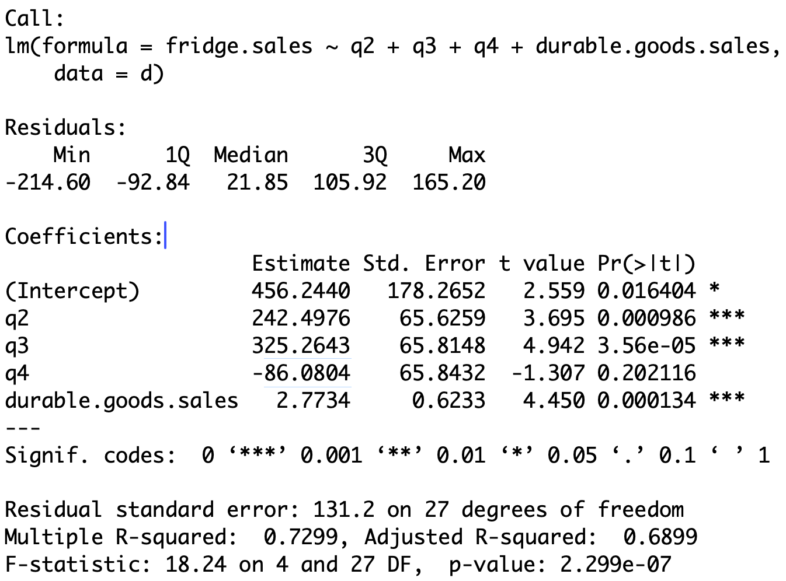

::: {.content-hidden}
$

$
:::


# Lecture 11: <br> ANOVA {background-color="#cc0164" visibility="uncounted"}

::: footer

<div color="#cc0164">  </div>

:::


## Outline of Lecture 11


1. One-way ANOVA
2. Factors in R
3. Anova with aov
4. Dummy variable regression models
5. ANOVA as Regression 
6. ANCOVA


# Part 1: <br> One-way ANOVA {background-color="#cc0164" visibility="uncounted"}

::: footer

<div color="#cc0164">  </div>

:::


## Introduction {.smaller}

- ANOVA means *Analysis of variance*

- Method of comparing means across samples

- We first present ANOVA in the traditional way

- Then we show that the ANOVA model is just a special form of linear regression 
    * In particular, ANOVA models can be fitted with ``lm``


## One-way ANOVA {.smaller}

- ANOVA allows to compare population means for several independent samples
    * Can be seen as generalization of t-test for two independent samples

- Suppose we have $k$ populations of interest, with distribution $N(\mu_k,\sigma^2)$
    * Note that the variance is the same for all populations

- Sample from population $i$ is denoted $x_{i1}, x_{i2}, \ldots , x_{in_i}$


**Goal**: Compare population means $\mu_i$

**Hypothesis set:** We test for a difference in means

\begin{align*}
H_0 \colon  & \mu_1 = \mu_2 = \ldots = \mu_k \\
H_1 \colon & \mu_i \neq \mu_j \,\, \text{ for at least one pair } \, i \neq j
\end{align*}


**ANOVA is generalization of two-sample t-test to multiple populations**


## Constructing a Test statistic {.smaller}

- We formulate a statistic which compares
    * variations within a single group to
    * variations among the groups


- Denote the mean of the i-th sample by 

$$
\overline{x}_i = \frac{1}{n_i} \sum_{j=1}^{n_i} x_{ij}
$$


- Denote the *grand mean* of all samples by 

$$
\overline{x} = \frac{1}{k} \sum_{i=1}^k  \overline{x}_i  =  \frac{1}{k} \sum_{i=1}^k \left( \frac{1}{n_i} \sum_{j=1}^{n_i} x_{ij} \right)
$$


## {.smaller}


- The **total sum of squares** is 

$$
\TSS := \sum_{i=1}^{k} \sum_{j=1}^{n_i} ( x_{ij} - \overline{x} )^2
$$


- $\TSS$ measures deviation of samples from the grand mean $\overline{x}$


- The **Error Sum of Squares** is 

$$
\ESS = \sum_{i=1}^k \sum_{j=1}^{n_i} (x_{ij} - \overline{x}_i)^2
$$

- The interior sum of $\ESS$ measures the variation within the i-th group

- $\ESS$ is then a measure of the within-group variability


## {.smaller}

- The **Treatment Sum of Squares** is

$$
\TrSS = \sum_{i=1}^{k} n_i ( \overline{x}_i - \overline{x})^2
$$

- $\TrSS$ compares the means for each group $\overline{x}_i$  with the grand mean $\overline{x}$

- $\TrSS$ is then a measure of variability among the groups

- Note: *Treatment* comes from medical experiments, where the population mean models the effect of some treatment

::: Proposition

The following decomposition holds

$$
\TSS = \ESS + \TrSS
$$

:::


## The ANOVA F-statistic {.smaller}

::: Definition

The F-statistic for the one-way ANOVA test is

$$
F = \frac{ \TrSS }{ k - 1  } \bigg/
      \frac{ \ESS }{ n - k  } 
$$

:::

::: Theorem 

Assume to have $k$ independent, i.i.d samples from $N(\mu_i,\sigma^2)$. Then

$$
F \ \sim \ F_{k-1,n-k} 
$$

:::


##  {.smaller}

::: {style="font-size: 0.93em"}


\begin{align*}
\text{Case 1: } \, H_0 \, \text{ holds } & \, \iff \,  \text{Population means are all the same}  \\[15pt]
 & \, \iff \,  \text{i-th sample mean is similar to grand mean: } \, \overline{x}_i  \approx \overline{x}  \,, \quad \forall\, i\\[15pt]
 & \, \iff \, \TrSS = \sum_{i=1}^{k} n_i ( \overline{x}_i - \overline{x})^2 \approx 0  \, \iff \, F = \frac{ \TrSS }{ k - 1  } \bigg/
      \frac{ \ESS }{ n - k  }  \approx 0 
 \end{align*}

\begin{align*}
\text{Case 2: } \, H_1 \, \text{ holds } & \, \iff \,  \text{At least two population means are different}  \\[15pt]
 & \, \iff \,  \text{At least two populations satisfy } \, (\overline{x}_i - \overline{x})^2 \gg 0  \\[15pt]
 & \, \iff \, \TrSS = \sum_{i=1}^{k} n_i ( \overline{x}_i - \overline{x})^2 \gg 0  \, \iff \, F = \frac{ \TrSS }{ k - 1  } \bigg/
      \frac{ \ESS }{ n - k  }  \gg 0 
 \end{align*}

**Therefore, the test is one-sided: $\,\,$ Reject $H_0 \iff F \gg 0$**

:::


## The one-way ANOVA F-test {.smaller}


Suppose given k **independent** samples

- Sample $x_{i1}, \ldots, x_{in_i}$ i.i.d from $N(\mu_i,\sigma^2)$


**Goal**: Compare population means $\mu_i$

**Hypothesis set:** We test for a difference in means

\begin{align*}
H_0 \colon  & \mu_1 = \mu_2 = \ldots = \mu_k \\
H_1 \colon & \mu_i \neq \mu_j \,\, \text{ for at least one pair } \, i \neq j
\end{align*}


## Procedure: 3 Steps {.smaller}

1. **Calculation**: Compute the samples mean and grand mean 
$$
\overline{x}_i = \frac{1}{n_i} \sum_{j=1}^{n_i} x_{ij} \,, \qquad 
\overline{x} = \frac{1}{k} \sum_{i=1}^k  \overline{x}_i  
$$
Compute the $\TrSS$ and $\ESS$ 
$$
\TrSS = \sum_{i=1}^{k} n_i ( \overline{x}_i - \overline{x})^2 \,, \qquad \ESS = \sum_{i=1}^k \sum_{j=1}^{n_i} (x_{ij} - \overline{x}_i)^2
$$
Compute the F-statistic
$$
F = \frac{ \TrSS }{ k - 1  } \bigg/
      \frac{ \ESS }{ n - k  }  \  \sim \ F_{k-1,n-k} 
$$


## {.smaller}

2. **Statistical Tables or R**: Find either
    * Critical value $F^*$ in [Table 3](files/Statistics_Tables.pdf)
    * p-value in R

<br>

3. **Interpretation**: Reject $H_0$ when either
$$
p < 0.05 \qquad \text{ or } \qquad F \in \,\,\text{Rejection Region}
$$


| Alternative                               | Rejection Region  | $F^*$              | p-value              |
|-------------------------------------------|-------------------|--------------------|----------------------|
| $\exists \,\, i \neq j$ s.t. $\mu_i \neq \mu_j$ | $F > F^*$         | $F_{k-1,n-k}(0.05)$| $P(F_{k-1,n-k} > F)$ |
: {tbl-colwidths="[35,20,20,25]"}


## Worked Example: Calorie Consumption {.smaller}

- Consider 15 subjects split at random into 3 groups

- Each group is assigned a month 

- For each group we record the number of calories consumed on a randomly chosen day

- Assume that calories consumed are normally distributed with common variance, but maybe different means

|       |      |      |      |      |      | 
|:---   |:--   |:--   |:--   |:--   |:--   |         
|**May**| 2166 | 1568 | 2233 | 1882 | 2019 |
|**Sep**| 2279 | 2075 | 2131 | 2009 | 1793 |
|**Dec**| 2226 | 2154 | 2583 | 2010 | 2190 |


**Question:** Is there a difference in calories consumed each month?


## Boxplot of the data {.smaller}
### To visually compare sample means for each population

```r
# Enter the data
may <- c(2166, 1568, 2233, 1882, 2019)
sep <- c(2279, 2075, 2131, 2009, 1793)
dec <- c(2226, 2154, 2583, 2010, 2190)

# Combine vectors into a list and label them
data <- list(May = may, September = sep, December = dec)

# Create the boxplot
boxplot(data,
        main = "Boxplot of Calories Consumed each month",
        ylab = "Daily calories consumed")
```


## {.smaller}

```{r}
# Enter the data
may <- c(2166, 1568, 2233, 1882, 2019)
sep <- c(2279, 2075, 2131, 2009, 1793)
dec <- c(2226, 2154, 2583, 2010, 2190)

# Combine vectors into a list and label them
data <- list(May = may, September = sep, December = dec)

# Create the boxplot
boxplot(data,
        main = "Boxplot of Calories Consumed each month",
        ylab = "Daily calories consumed")
```

- It seems that consumption is, on average, higher in colder months

- We suspect population means are different: need one-way ANOVA F-test


## Performing the one-way ANOVA F-test {.smaller}

- We first compute sample means and grand mean
$$
\overline{x}_i = \frac{1}{n_i} \sum_{j=1}^{n_i} x_{ij} \,, \qquad 
\overline{x} = \frac{1}{k} \sum_{i=1}^k  \overline{x}_i  
$$

```r
# Compute means for each sample
may.bar <- mean(may)
sep.bar <- mean(sep)
dec.bar <- mean(dec)


# Compute grand mean
x.bar <- mean(c(may, sep, dec))
```


## {.smaller}

- There are 3 groups, each with $n_i = 5$ samples

- Compute the $\TrSS$ and $\ESS$ 
$$
\TrSS = \sum_{i=1}^{k} n_i ( \overline{x}_i - \overline{x})^2 = 5 \sum_{i=1}^{k} ( \overline{x}_i - \overline{x})^2 \,, \qquad \ESS = \sum_{i=1}^k \sum_{j=1}^{n_i} (x_{ij} - \overline{x}_i)^2
$$


::: {style="font-size: 0.92em"}

```r
# Compute TrSS
TrSS <- 5 * ( (may.bar - x.bar)^2 + (sep.bar - x.bar)^2 + (dec.bar - x.bar)^2 )

# Compute ESS
ESS <- sum((may - may.bar)^2) + sum((sep - sep.bar)^2) + sum((dec - dec.bar)^2)

# Print result
c(TrSS = TrSS, ESS = ESS)
```

:::

```{r}
# Enter the data
may <- c(2166, 1568, 2233, 1882, 2019)
sep <- c(2279, 2075, 2131, 2009, 1793)
dec <- c(2226, 2154, 2583, 2010, 2190)

# Compute means for each sample
may.bar <- mean(may)
sep.bar <- mean(sep)
dec.bar <- mean(dec)

# Compute grand mean
x.bar <- mean(c(may, sep, dec))

# Compute TrSS
TrSS <- 5 * (may.bar - x.bar)^2 + 5 * (sep.bar - x.bar)^2 + 5 * (dec.bar - x.bar)^2

# Compute ESS
ESS <- sum((may - may.bar)^2) + sum((sep - sep.bar)^2) + sum((dec - dec.bar)^2)

# Print result
c(TrSS = TrSS, ESS = ESS)
```


## {.smaller}

- We have $k = 3$ groups; $\, n = 15$ total samples

- Compute the F-statistic

$$
F = \frac{ \TrSS }{ k - 1  } \bigg/
      \frac{ \ESS }{ n - k  }  \  \sim \ F_{k-1,n-k} 
$$


```r
# Enter number of groups and sample size
k <- 3; n <- 15

# Compute F-statistic
F.obs = ( TrSS/(k-1) ) / ( ESS/(n-k) )

# Print
F.obs
```

```{r}
# Enter the data
may <- c(2166, 1568, 2233, 1882, 2019)
sep <- c(2279, 2075, 2131, 2009, 1793)
dec <- c(2226, 2154, 2583, 2010, 2190)

# Compute means for each sample
may.bar <- mean(may)
sep.bar <- mean(sep)
dec.bar <- mean(dec)

# Compute grand mean
x.bar <- mean(c(may, sep, dec))

# Compute TrSS
TrSS <- 5 * (may.bar - x.bar)^2 + 5 * (sep.bar - x.bar)^2 + 5 * (dec.bar - x.bar)^2

# Compute ESS
ESS <- sum((may - may.bar)^2) + sum((sep - sep.bar)^2) + sum((dec - dec.bar)^2)

# Enter number of groups and sample size
k <- 3; n <- 15

# Compute F-statistic
F.obs = ( TrSS/(k-1) ) / ( ESS/(n-k) )

# Print
F.obs
```


## {.smaller}

- Compute the p-value

$$
p = P( F_{k-1,n-k} > F ) = 1 - P( F_{k-1,n-k} \leq F )
$$


```r 
# Compute the p-value
p <- 1 - pf(F.obs, df1 = k-1, df2 = n-k)

# Print
p
```


```{r} 
# Enter the data
may <- c(2166, 1568, 2233, 1882, 2019)
sep <- c(2279, 2075, 2131, 2009, 1793)
dec <- c(2226, 2154, 2583, 2010, 2190)

# Compute means for each sample
may.bar <- mean(may)
sep.bar <- mean(sep)
dec.bar <- mean(dec)

# Compute grand mean
x.bar <- mean(c(may, sep, dec))

# Compute TrSS
TrSS <- 5 * (may.bar - x.bar)^2 + 5 * (sep.bar - x.bar)^2 + 5 * (dec.bar - x.bar)^2

# Compute ESS
ESS <- sum((may - may.bar)^2) + sum((sep - sep.bar)^2) + sum((dec - dec.bar)^2)

# Enter number of groups and sample size
k <- 3; n <- 15

# Compute F-statistic
F.obs = ( TrSS/(k-1) ) / ( ESS/(n-k) )

# Compute the p-value
p <- 1 - pf(F.obs, df1 = k-1, df2 = n-k)

# Print
p
```

::: {style="font-size: 0.10em"}

<br>

:::

- The p-value is $p > 0.05 \quad \implies \quad$ Do not reject $H_0$

- No reason to believe that population means are different

- Conclusion: Despite the boxplot, the variation in average monthly calories consumption can be explained by chance only 

**Next: Use native R command for ANOVA test - Need Factors**


# Part 2: <br>Factors in R {background-color="#cc0164" visibility="uncounted"}

::: footer

<div color="#cc0164">  </div>

:::


## Factors in R {.smaller}


- **Factors:** A way to represent discrete variables taking a finite number of values


- **Example:** Suppose to have a vector of people's names

```r
firstname <- c("Liz", "Jolene", "Susan", "Boris", "Rochelle", "Tim")
```

- Let us store the sex of each person as either 
    * Numbers: $\, \texttt{1}$ represents female and $\texttt{0}$ represents male
    * Strings: $\, \texttt{"female"}$ and $\texttt{"male"}$


```r
sex.num <- c(1, 1, 1, 0, 1, 0)
sex.char <- c("female", "female", "female", "male", "female", "male")
```


## The factor command {.smaller}

- The $\, \texttt{factor}$ command turns a vector into a factor

```r
sex.num <- c(1, 1, 1, 0, 1, 0)

# Turn sex.num into a factor
sex.num.factor <- factor(sex.num)

# Print the factor obtained
print(sex.num.factor)
```

```{r}
sex.num <- c(1, 1, 1, 0, 1, 0)

# Turn sex.num into a factor
sex.num.factor <- factor(sex.num)

# Print the factor obtained
print(sex.num.factor)
```

::: {style="font-size: 0.20em"}

<br>

:::

- The factor $\, \texttt{sex.num.factor}$ looks like the original vector $\, \texttt{sex.num}$

- The difference is that the factor $\, \texttt{sex.num.factor}$ contains **levels**
    * In this case the levels are $\, \texttt{0}$ and $\, \texttt{1}$
    * Levels are all the (discrete) values assumed by the vector $\, \texttt{sex.num}$


## The factor command {.smaller}

- In the same way we can convert $\, \texttt{sex.char}$ into a factor

```r
sex.char <- c("female", "female", "female", "male", "female", "male")

# Turn sex.char into a factor
sex.char.factor <- factor(sex.char)

# Print the factor obtained
print(sex.char.factor)
```

```{r}
sex.char <- c("female", "female", "female", "male", "female", "male")

# Turn sex.char into a factor
sex.char.factor <- factor(sex.char)

# Print the factor obtained
print(sex.char.factor)
```


::: {style="font-size: 0.20em"}

<br>

:::

- Again, the factor $\, \texttt{sex.char.factor}$ looks like the original vector $\, \texttt{sex.char}$

- Again, the difference is that the factor $\, \texttt{sex.char.factor}$ contains **levels**
    * In this case the levels are strings $\, \texttt{"female"}$ and $\, \texttt{"male"}$
    * These 2 strings are all the values assumed by the vector $\, \texttt{sex.char}$


## Reordering the Levels {.smaller}

- Factor levels are automatically ordered by R
    * Increasing order for numerical factors; Alphabetical order for string factors

- We can manually reorder the factor levels. For example, compare:

```r
sex.char <- c("female", "female", "female", "male", "female", "male")

# Turn sex.char into a factor
factor(sex.char)
```

```{r}
sex.char <- c("female", "female", "female", "male", "female", "male")

# Turn sex.char into a factor
factor(sex.char)
```

<br>

```r
# Turn sex.char into a factor, swapping the levels
factor(sex.char, levels = c("male", "female"))
```

```{r}
sex.char <- c("female", "female", "female", "male", "female", "male")

# Turn sex.char into a factor, swapping the levels
factor(sex.char, levels = c("male", "female"))
```


## Subsetting factors {.smaller}

- Factors can be subsetted exactly like vectors


```r
sex.num.factor
```
```{r} 
sex.num <- c(1, 1, 1, 0, 1, 0)
sex.num.factor <- factor(sex.num)
print(sex.num.factor)
```

::: {style="font-size: 0.30em"}

<br>

:::


```r
sex.num.factor[2:5]
```

```{r} 
sex.num <- c(1, 1, 1, 0, 1, 0)
sex.num.factor <- factor(sex.num)
print(sex.num.factor[2:5])
```


## Subsetting factors {.smaller}


- **Warning:** After subsetting a factor, all defined levels are still stored
    * This is true even if some of the levels are no longer represented in the subsetted factor

::: {style="font-size: 0.30em"}

<br>

:::

```r
sex.char.factor
```

```{r}
sex.char <- c("female", "female", "female", "male", "female", "male")
sex.char.factor <- factor(sex.char)
sex.char.factor
```

::: {style="font-size: 0.30em"}

<br>

:::


```r
sex.char.factor[c(1:3, 5)]
```

```{r}
sex.char <- c("female", "female", "female", "male", "female", "male")
sex.char.factor <- factor(sex.char)
sex.char.factor[c(1:3, 5)]
```

::: {style="font-size: 0.30em"}

<br>

:::


- The levels of ``sex.char.factor[c(1:3, 5)]`` are still $\, \texttt{"female"}$ and $\, \texttt{"male"}$

- This is despite ``sex.char.factor[c(1:3, 5)]`` only containing $\, \texttt{"female"}$


## The levels function {.smaller}

- The levels of a factor can be extracted with the function $\, \texttt{levels}$

```r 
levels(sex.char.factor)
```

```{r} 
sex.char <- c("female", "female", "female", "male", "female", "male")

sex.char.factor <- factor(sex.char)

# Print the factor obtained
print(levels(sex.char.factor))
```


::: {style="font-size: 0.30em"}

<br>

:::


- **Note:** Levels of a factor are always stored as **strings**, even if originally numbers


::: {style="font-size: 0.10em"}

<br>

:::

```r 
levels(sex.num.factor)
```

```{r} 
sex.num <- c(1, 1, 1, 0, 1, 0)

sex.num.factor <- factor(sex.num)

print(levels(sex.num.factor))
```


::: {style="font-size: 0.10em"}

<br>

:::

- The levels of $\, \texttt{sex.num.factor}$ are the strings $\, \texttt{"0"}$ and $\, \texttt{"1"}$

- This is despite the original vector $\, \texttt{sex.num}$ being numeric

- The command $\, \texttt{factor}$ converted numeric levels into strings


## Relabelling a factor {.smaller}

- The function $\, \texttt{levels}$ can also be used to **relabel** factors

- For example we can relabel
    * $\, \texttt{female}$ into $\, \texttt{f}$
    * $\, \texttt{male}$ into $\, \texttt{m}$


```r
# Relabel levels of sex.char.factor
levels(sex.char.factor) <- c("f", "m")

# Print relabelled factor
print(sex.char.factor)
```

```{r}
sex.char <- c("female", "female", "female", "male", "female", "male")
sex.char.factor <- factor(sex.char)

levels(sex.char.factor) <- c("f", "m")
print(sex.char.factor)
```


## Logical subsetting of factors {.smaller}

- Logical subsetting is done exactly like in the case of vectors

- **Important:** Need to remember that levels are always **strings**

- **Example:** To identify all the men in $\, \texttt{sex.num.factor}$ we do

::: {style="font-size: 0.20em"}

<br>

:::

```r
sex.num.factor == "0"
```

```{r}
sex.num <- c(1, 1, 1, 0, 1, 0)

sex.num.factor <- factor(sex.num)

sex.num.factor == "0"
```


::: {style="font-size: 0.20em"}

<br>

:::


- To retrieve names of men stored in $\, \texttt{firstname}$ use logical subsetting

::: {style="font-size: 0.20em"}

<br>

:::

```r
firstname <- c("Liz", "Jolene", "Susan", "Boris", "Rochelle", "Tim")

firstname[ sex.num.factor == "0" ]
```

```{r}
firstname <- c("Liz", "Jolene", "Susan", "Boris", "Rochelle", "Tim")

sex.num <- c(1, 1, 1, 0, 1, 0)

sex.num.factor <- factor(sex.num)

firstname[ sex.num.factor == "0" ]
```


# Part 3: <br>ANOVA with aov {background-color="#cc0164" visibility="uncounted"}

::: footer

<div color="#cc0164">  </div>

:::


## Anova with aov  {.smaller}

- We have conducted the one-way ANOVA F-test by hand
    *  This is cumbersome with large datasets with many populations
    * The quick way in R is to use the command ``aov`` (*analysis of variance*)


## Method  {.smaller}

- Place all the samples into one long vector ``values``

- Create a vector with corresponding group labels ``ind``

- Turn ``ind`` into a factor

- Combine ``values`` and ``ind`` into a dataframe ``d``


- Therefore, dataframe ``d`` contains:
    * First Column: *values* for each sample
    * Second Column: *ind*, indicating the group the corresponding sample is from


- The ANOVA F-test is performed with

$$
\text{aov(values } \sim \text{ ind, data = d)}
$$


- ``values ~ ind`` is the formula coupling values to the corresponding group


## Example 1: Calorie Consumption {.smaller}

- Recall: we have 15 subjects split at random into 3 groups

- Each group is assigned a month 

- For each group we record the number of calories consumed on a randomly chosen day

- Assume that calories consumed are normally distributed with common variance, but maybe different means

|       |      |      |      |      |      | 
|:---   |:--   |:--   |:--   |:--   |:--   |         
|**May**| 2166 | 1568 | 2233 | 1882 | 2019 |
|**Sep**| 2279 | 2075 | 2131 | 2009 | 1793 |
|**Dec**| 2226 | 2154 | 2583 | 2010 | 2190 |


**Question:** Is there a difference in calories consumed each month?


## Preparing the data {.smaller}


::: {style="font-size: 0.86em"}

:::: {.columns}

::: {.column width="60%"}

```r
# Enter the data
may <- c(2166, 1568, 2233, 1882, 2019)
sep <- c(2279, 2075, 2131, 2009, 1793)
dec <- c(2226, 2154, 2583, 2010, 2190)

# Combine values into one long vector
values <- c(may, sep, dec)

# Create vector of group labels
ind <- rep(c("May", "Sep", "Dec"), each = 5)

# Turn vector of group labels into a factor
# Note that we order the levels
ind <- factor(ind, levels = c("May", "Sep", "Dec"))

# Combine values and labels into a data frame
d <- data.frame(values, ind)

# Print d for visualization
print(d)
```

:::


::: {.column width="40%"}

```{r}
# Enter the data
may <- c(2166, 1568, 2233, 1882, 2019)
sep <- c(2279, 2075, 2131, 2009, 1793)
dec <- c(2226, 2154, 2583, 2010, 2190)

# Combine values into one long vector
values <- c(may, sep, dec)

# Create vector of group labels
ind <- rep(c("May", "Sep", "Dec"), each = 5)

# Turn vector of group labels into a factor
# Note that we order the levels
ind <- factor(ind, levels = c("May", "Sep", "Dec"))

# Combine values and labels into a data frame
d <- data.frame(values, ind)

# Print d for visualization
print(d)
```

:::

:::

:::


## Boxplot of the data {.smaller}

- Previously, we constructed a boxplot by placing the data into a list

- Now that we have a dataframe, the commands are much simpler:
    * Pass the dataframe ``d`` to ``boxplot``
    * Pass the formula ``values ~ ind``


```r
boxplot(values ~ ind, data = d,
        main = "Boxplot of Calories Consumed each month",
        ylab = "Daily calories consumed")
```


## {.smaller}

```{r}
# Enter the data
may <- c(2166, 1568, 2233, 1882, 2019)
sep <- c(2279, 2075, 2131, 2009, 1793)
dec <- c(2226, 2154, 2583, 2010, 2190)

# Combine values into one long vector
values <- c(may, sep, dec)

# Create vector of group labels
ind <- rep(c("May", "Sep", "Dec"), each = 5)

# Turn vector of group labels into a factor
# Note that we order the levels
ind <- factor(ind, levels = c("May", "Sep", "Dec"))

# Combine values and labels into a data frame
d <- data.frame(values, ind)

boxplot(values ~ ind, data = d,
        main = "Boxplot of Calories Consumed each month",
        ylab = "Daily calories consumed")
```


- Already observed: Consumption is, on average, higher in colder months

- We suspect population means are different: need one-way ANOVA F-test

- We have already conducted the test by hand. We now use ``aov``


## Calling aov {.smaller}

- Data is stored in dataframe ``d``
    * 1st column ``values`` contains calories consumed
    * 2nd column ``ind`` contains month labels

```r
# Perform ANOVA F-test for difference in means
model <- aov(values ~ ind, data = d)

# Print summary
summary(model)
```


```{r}
# Enter the data
may <- c(2166, 1568, 2233, 1882, 2019)
sep <- c(2279, 2075, 2131, 2009, 1793)
dec <- c(2226, 2154, 2583, 2010, 2190)

# Combine values into one long vector
values <- c(may, sep, dec)

# Create vector of group labels
ind <- rep(c("May", "Sep", "Dec"), each = 5)

# Turn vector of group labels into a factor
ind <- factor(ind)

# Combine values and labels into a data frame
d <- data.frame(values, ind)

# Perform ANOVA F-test
model <- aov(values ~ ind, data = d)

# Print summary
summary(model)
```

- As obtained with hand calculation, the p-value is $p = 0.209$

- $p > 0.05 \implies$ Do not reject $H_0$: Population means are similar


## Example 2: ANOVA vs Two-sample t-test {.smaller}

When only 2 groups are present, they coincide:

- ANOVA F-test for difference in means

- Two-sample t-test for difference in means  
(with assumption of equal variance)

**Example:** Let us compare calories data only for the months of May and Dec

<br>

|       |      |      |      |      |      | 
|:---   |:--   |:--   |:--   |:--   |:--   |         
|**May**| 2166 | 1568 | 2233 | 1882 | 2019 |
|**Dec**| 2226 | 2154 | 2583 | 2010 | 2190 |


## {.smaller}

- First, let us conduct a two-sample t-test for difference in means

```r
# Enter the data
may <- c(2166, 1568, 2233, 1882, 2019)
dec <- c(2226, 2154, 2583, 2010, 2190)

# Two-sample t-test for difference in means
t.test(may, dec, var.equal = T)$p.value
```

```{r}
# Enter the data
may <- c(2166, 1568, 2233, 1882, 2019)
dec <- c(2226, 2154, 2583, 2010, 2190)

# Two-sample t-test for difference in means
t.test(may, dec, var.equal = T)$p.value
```


<br>

- The p-value is $p \approx 0.126$

- Since $p > 0.05$, we do not reject $H_0$

- In particular, we conclude that populations means are similar:
    * Calories consumed in May and December do not differ on average


## {.smaller}

::: {style="font-size: 0.92em"}

- Let us now compare the two population means with the ANOVA F-test

```r
# Combine values into one long vector
values <- c(may, dec)

# Create factor of group labels
ind <- factor(rep(c("May", "Dec"), each = 5))

# Combine values and labels into a data frame
d <- data.frame(values, ind)

# Perform ANOVA F-test
model <- aov(values ~ ind, data = d)

# Print summary
summary(model)
```


```{r}
# Enter the data
may <- c(2166, 1568, 2233, 1882, 2019)
dec <- c(2226, 2154, 2583, 2010, 2190)

# Combine values into one long vector
values <- c(may, dec)

# Create factor of group labels
ind <- factor(rep(c("May", "Dec"), each = 5))

# Combine values and labels into a data frame
d <- data.frame(values, ind)

# Perform ANOVA F-test
model <- aov(values ~ ind, data = d)

# Print summary
summary(model)
```

::: {style="font-size: 0.10em"}

<br>

:::

- The p-values $p \approx 0.126$ coincide! ANOVA F-test and Two-sample t-test are equivalent

- This fact is discussed in details in the next 2 Parts

:::


# Part 4: <br>Dummy variable <br> Regression {background-color="#cc0164" visibility="uncounted"}

::: footer

<div color="#cc0164">  </div>

:::


## Explaining the terminology {.smaller}


- **Dummy variable:** Variables $X$ which are qualitative in nature

- **ANOVA:** refers to situations where regression models contain 
    * **only** dummy variables $X$
    * This generalizes the ANOVA F-test seen earlier


- **ANCOVA:** refers to situations where regression models contain a combination of 
    * dummy variables **and** quantitative (the usual) variables


## Dummy variables {.smaller}


- **Dummy variable:** 
    * A variable $X$ which is qualitative in nature
    * Often called **cathegorical variables**


- Regression models can include dummy variables


- Qualitatitve **binary** variables can be represented by $X$ with
    * $X = 1 \,$ if effect present
    * $X = 0 \,$ if effect not present


- Examples of **binary** quantitative variables are
    * On / Off
    * Yes / No
    * Sample is from Population A / B


## Dummy variables {.smaller}

- Dummy variables can also take several values 
    * These values are often called **levels**
    * Such variables are represented by $X$ taking discrete values

- Examples of dummy variables with several levels
    * Month: Jan, Feb, Mar, ...
    * Season: Summer, Autumn, Winter, Spring
    * Priority: Low, Medium, High
    * Quarterly sales data: Q1, Q2, Q3, Q4
    * UK regions: East Midlands, London Essex, North East/Yorkshire, ...


## Example: Fridge sales data {.smaller}

::: {style="font-size: 0.90em"}

- Consider the dataset on quarterly fridge sales [fridge_sales.txt](datasets/fridge_sales.txt)
    * Each entry represents sales data for 1 quarter
    * 4 consecutive entries represent sales data for 1 year


::: {style="font-size: 0.20em"}

<br>

:::

```{r}
sales <- read.table(file = "datasets/fridge_sales.txt",
                    header = TRUE)

print(sales)
```

::: 


##  {.smaller}

::: {style="font-size: 0.90em"}

- Below are the first 4 entries of the *Fridge sales dataset*
    * These correspond to 1 year of sales data

- First two variables are quantitative
    * *Fridge Sales* $=$ total quarterly fridge sales (in million \$)
    * *Duarable Goods Sales* $=$ total quarterly durable goods sales (in billion \$)

- Remaining variables are qualitative:
    * *Q1*, *Q2*, *Q3*, *Q4* $\,$ take values 0 / 1  $\quad$ (representing 4 yearly quarters)
    * *Quarter* $\,$ takes values 1 / 2 / 3 / 4  $\quad$ (equivalent representation of quarters)


::: {style="font-size: 0.40em"}

<br>

:::

| Fridge Sales | Durable Goods Sales | Q1 | Q2 | Q3 | Q4 | Quarter |
|--------------|---------------------|----|----|----|----|---------|
| 1317         | 252.6               | 1  | 0  | 0  | 0  | 1       |
| 1615         | 272.4               | 0  | 1  | 0  | 0  | 2       |
| 1662         | 270.9               | 0  | 0  | 1  | 0  | 3       |
| 1295         | 273.9               | 0  | 0  | 0  | 1  | 4       |

:::


## Encoding Quarter in regression model {.smaller}

**Two alternative approaches:**

1. Include $4-1 = 3$ dummy variables with values 0 / 1
    * Each dummy variable represents 1 Quarter
    * We need 3 variables to represent 4 Quarters (plus the intercept)

2. Include one variable which takes values 1 / 2 / 3 / 4 


**Differences between the two approaches:**

1. This method works with command ``lm``

2. This method works with the command ``aov``


## The dummy variable trap {.smaller}

- Suppose you follow the first approach:
    * Encode each quarter with a separate variable

- If you have 4 different levels, you would need 
    * $4-1=3$ dummy variables
    * the intercept term

- In general: if you have $k$ different levels, you would need 
    * $k-1$ dummy variables
    * the intercept term

**Question:** Why only $k - 1$ dummy variables?

**Answer:** To avoid the **dummy variable trap**


## Example: Dummy variable trap {.smaller}


To illustrate the dummy variable trap, consider the following

- Encode each Quarter with one dummy variable $\one_i$

$$
\one_j(i) = \begin{cases}
1 & \text{ if sample i belongs to Quarter j} \\
0 & \text{ otherwise} \\
\end{cases}
$$


- Consider the regression model with intercept

$$
Y = \beta_0 \cdot (1) + \beta_1 \one_1 + \beta_2 \one_2 + \beta_3 \one_3 + \beta_4 \one_4   + \e
$$

- In the above, $Y$ is the quartely *Fridge sales data*


## {.smaller}

- Each data entry belongs to exactly one Quarter. Thus

$$
\one_1 + \one_2 + \one_3 + \one_4 = 1
$$


- **Dummy variable trap:** Variables are collinear (linearly dependent)

- Indeed the design matrix is 

$$
Z = 
\left( 
\begin{array}{ccccc}
1 & 1 & 0 & 0 & 0 \\
1 & 0 & 1 & 0 & 0 \\
1 & 0 & 0 & 1 & 0 \\
1 & 0 & 0 & 0 & 1 \\
1 & 1 & 0 & 0 & 0 \\
\dots & \dots & \dots & \dots & \dots \\
\end{array}
\right)
$$

- First column is the sum of remaining columns $\quad \implies \quad$ Multicollinearity


## Example: Avoiding dummy variable trap {.smaller}

- We want to avoid Multicollinearity (or dummy variable trap)

- **How?** Drop one dummy variable (e.g. the first) and consider the model

$$
Y = \beta_1 \cdot (1) + \beta_2 \one_2 + \beta_3 \one_3 + \beta_4 \one_4  + \e
$$


- If data belongs to Q1, then $\one_2 = \one_3 = \one_4 = 0$


- Therefore, in general, we have

$$
\one_2 + \one_3 + \one_4 \not\equiv 1
$$

- This way we **avoid** Multicollinearity $\quad \implies \quad$ **no trap!**


## {.smaller}


- **Question:** How do we interpret the coefficients in the model 

$$
Y = \beta_1 \cdot (1)  + \beta_2 \one_2 + \beta_3 \one_3 + \beta_4 \one_4  + \e \qquad ?
$$


- **Answer:** Recall the relationship 

$$
\one_1 + \one_2 + \one_3 + \one_4 = 1
$$

- Substituting in the regression model we get

\begin{align*}
Y & = \beta_1 \cdot ( \one_1 + \one_2 + \one_3 + \one_4 ) + \beta_2 \one_2 + \beta_3 \one_3 + \beta_4 \one_4  + \e \\[10pts]
& = \beta_1 \one_1 + (\beta_1 + \beta_2) \one_2 + (\beta_1 + \beta_3) \one_3 + (\beta_1 + \beta_4 ) \one_4 + \e  
\end{align*}


## {.smaller}

Therefore, the regression coefficients are such that

| Group        | Increase Described By         |
|--------------|-------------------------------|
| $\one_1$        | $\beta_1$                     |
| $\one_2$        | $\beta_1 + \beta_2$           |
| $\one_3$        | $\beta_1 + \beta_3$           |
| $\one_4$        | $\beta_1 + \beta_4$           |


**Conclusion:** When fitting regression model with dummy variables

- Increase for first dummy variable $\one_1$ is intercept term $\beta_1$

- Increase for successive dummy variables $\one_i$ with $i > 1$ is computed by
$\beta_1 + \beta_i$


**Intercept coefficient acts as base reference point**


## General case: Dummy variable trap {.smaller}


- Suppose to have a qualitative variable $X$ which takes $k$ different levels
    * E.g. the previous example has $k = 4$ quarters


- Encode each level of $X$ in one dummy variable $\one_j$

$$
\one_j(i) = \begin{cases}
1 & \text{ if } X(i) = j \\
0 & \text{ otherwise} \\
\end{cases}
$$


- To each data entry corresponds one and only one level of $X$, so that 

$$
\one_1 + \one_2 + \ldots + \one_k = 1
$$


- Hence **Multicollinearity** if intercept is present $\, \implies \,$ **Dummy variable trap!**


## General case: Avoid the trap!  {.smaller}

- We drop the first dummy variable $\one_1$ and consider the model

$$
Y = \beta_1 \cdot (1)  + \beta_2 \one_2 + \beta_3 \one_3 + \ldots + \beta_k \one_k  + \e 
$$


- For data points such that $X = 1$, we have

$$
\one_2 = \one_3 = \ldots = \one_k = 0
$$

- Therefore, in general, we get

$$
\one_2 + \one_3 + \ldots + \one_k \not \equiv 1
$$

- This way we avoid Multicollinearity $\quad \implies \quad$ **no trap!**


## General case: Interpret the output  {.smaller}

- How to interpret the coefficients in the model

$$
Y = \beta_1 \cdot (1)  + \beta_2 \one_2 + \beta_3 \one_3 + \ldots + \beta_k \one_k  + \e  \quad ?
$$

- We can argue similarly to the case $m = 4$ and use the constraint

$$
\one_1 + \one_2 + \ldots + \one_k = 1
$$

- Substituting in the regression model we get

$$
Y = \beta_1 \one_1 + (\beta_1 + \beta_2) \one_2 + \ldots + (\beta_1 + \beta_k) \one_k + \e
$$


## {.smaller}


**Conclusion:** When fitting regression model with dummy variables

| Group        | Increase Described By         |
|--------------|-------------------------------|
| $\one_1$     | $\beta_1$                     |
| $\one_i$     | $\beta_1 + \beta_i$           |

- Increase for first dummy variable $\one_1$ is intercept term $\beta_1$

- Increase for successive dummy variables $\one_i$ with $i > 1$ is computed by
$\beta_1 + \beta_i$


**Intercept coefficient acts as base reference point**


# Part 5: <br> ANOVA as Regression {background-color="#cc0164" visibility="uncounted"}

::: footer

<div color="#cc0164">  </div>

:::


## ANOVA F-test and regression {.smaller}


- ANOVA can be seen as linear regression problem, by using *dummy variables*

- In particular, we will show that
    * **ANOVA F-test is equivalent to F-test for overall significance**

::: {style="font-size: 0.2em"}

<br>

:::


- We have already seen a particular instance of this fact in the Homework
    * **Simple linear regression can be used to perform two-sample t-test**  
    (recall that two-sample t-test is just the ANOVA F-test with two populations)


::: {style="font-size: 0.2em"}

<br>

:::

- This was done by considering the model

$$
Y_i = \beta_1 + \beta_2 \, \one_2 (i) + \e_i
$$


## Simple regression for two-sample t-test {.smaller}


- Assume given two independent normal populations $N(\mu_1, \sigma^2)$ and $N(\mu_2, \sigma^2)$

- We have two samples
  * Sample of size $n_1$ iid from population $1$
  $$
  a = (a_1, \ldots, a_{n_1})
  $$
  * Sample of size $n_2$ iid from population $2$
  $$
  b = (b_1, \ldots, b_{n_2})
  $$


- The data vector $y$ is obtained by concatenating $a$ and $b$

$$
y = (a,b) = (a_1, \ldots, a_{n_1}, b_1, \ldots, b_{n_2} )
$$


## {.smaller}

- We then considered the dummy variable model

$$
Y_i = \beta_1 + \beta_2 \, \one_2 (i) + \e_i
$$

- Here $\one_2 (i)$ is the dummy variable relative to population $B$

$$
\one_2(i) = \begin{cases}
1 & \text{ if i-th sample belongs to population 2} \\
0 & \text{ otherwise}
\end{cases}
$$

- The regression function is therefore

$$
\Expect[Y | \one_2 = x] = \beta_1 + \beta_2 x 
$$


## {.smaller}


- By construction, we have that 

$$
Y | \text{sample belongs to population 1}  \ \sim \ N(\mu_1, \sigma^2)
$$


- Therefore, by definition of $\one_2$, we get

$$
\Expect[Y | \one_2 = 0] = \Expect [Y | \text{ sample belongs to population 1}] = \mu_1
$$


- On the other hand, the regression function is

$$
\Expect[Y | \one_2 = x] = \beta_1 + \beta_2 x 
$$

- Thus

$$
\Expect[Y | \one_2 = 0] = \beta_1 + \beta_2 \cdot 0 = \beta_1
\qquad \implies \qquad \beta_1 = \mu_1
$$


##  {.smaller}

- Similarly, by construction, we have that 

$$
Y | \text{sample belongs to population 2}  \ \sim \ N(\mu_2, \sigma^2)
$$

- Therefore, by definition of $\one_2$, we get

$$
\Expect[Y | \one_2 = 1] = \Expect [Y | \text{ sample belongs to population 2}] = \mu_2
$$


- On the other hand, the regression function is

$$
\Expect[Y | \one_2 = x] = \beta_1 + \beta_2 x 
$$

- Thus

$$
\Expect[Y | \one_2 = 1] = \beta_1 + \beta_2 
\qquad \implies \qquad \beta_1 + \beta_2 = \mu_2
$$


##  {.smaller}

::: {style="font-size: 0.93em"}

- Therefore, we have proven

$$
\beta_1 = \mu_1 \,, \qquad \beta_1 + \beta_2 = \mu_2 \qquad \implies \qquad \beta_2 = \mu_2 - \mu_1
$$

- Recall the the regression model is 

$$
Y_i = \beta_1 + \beta_2  \, \one_{2} (i) + \e_i 
$$

- The hypothesis for F-test for Overall Significance for above model is 

$$
H_0 \colon \beta_2 = 0 \,, \qquad H_1 \colon \beta_2 \neq 0
$$


- Since $\beta_2 = \mu_2 - \mu_1$, the above hypothesis is equivalent to
$$
H_0 \colon \mu_1 = \mu_2 \,, \qquad  H_1 \colon \mu_1 \neq \mu_2 
$$

- **Hypotheses for F-test of Overall Significance and two-sample t-test are equivalent**

:::


## {.smaller}

- In the Homework, we have also proven that the ML estimators for the model
$$
Y_i = \beta_1 + \beta_2  \, \one_{2} (i) + \e_i 
$$
satisfy
$$
\hat{\beta}_1 = \overline{a} \,, \qquad 
\hat{\beta}_2 = \overline{b} - \overline{a}
$$

- With this information, it is easy to check that they are equivalent
    * F-statistic for Overall Significance
    * t-statistic for two-sample t-test


- **F-test of Overall Significance and two-sample t-test are equivalent**


## {.smaller}

- In particular, the (fitted) dummy variable regression model is

\begin{align*}
Y_i & = \hat{\beta}_1 + \hat{\beta}_2  \, \one_{2} (i) + \e_i \\[10pt]
& = \overline{a} + (\overline{b} - \overline{a}) \, \one_{2} (i) + \e_i
\end{align*}


- Therefore, the predictions are:

\begin{align*}
\Expect[Y| \text{Sample is from population 1}] & = \overline{a} \\[10pt]
\Expect[Y| \text{Sample is from population 2}] & = \overline{b}
\end{align*}


## ANOVA F-test and Regression {.smaller}

Now, consider the general ANOVA case

- Assume given $k$ independent populations with normal distribution $N(\mu_i,\sigma^2)$

::: {style="font-size: 0.1em"}

<br>

:::

- **Example:** In Fridge sales example we have $k = 4$ populations (the 4 quarters)

::: {style="font-size: 0.1em"}

<br>

:::

- The ANOVA hypothesis for difference in populations means is

\begin{align*}
H_0 & \colon \mu_1 = \mu_2 = \ldots =  \mu_k  \\ 
H_1 & \colon \mu_i \neq \mu_j \text{ for at least one pair i and j}
\end{align*}


- **Goal:** Show the ANOVA F-test for above hypothesis can be obtained with regression


##  {.smaller}

- We want to introduce dummy variable regression model which models ANOVA

- To each population, associate a dummy variable
$$
\one_{i}(j) = \begin{cases}
1 & \text{ if j-th sample belongs to population i} \\
0 & \text{ otherwise} \\
\end{cases}
$$


- Denote by $x_{i1}, \ldots, x_{in_i}$ the iid sample of size $n_{i}$ from population $i$

- Concatenate these samples into a long vector (length $n_1 + \ldots + n_2$)
$$
y = (\underbrace{x_{11}, \ldots, x_{1n_1}}_{\text{population 1}}, \, \underbrace{x_{21}, \ldots, x_{2n_2}}_{\text{population 2}} , \,  \ldots, \, \underbrace{x_{k1}, \ldots, x_{kn_k}}_{\text{population k}})
$$

- Consider the dummy variable model (with $\one_{1}$ omitted)
$$
Y_i = \beta_1 + \beta_2 \, \one_{2} (i) + \beta_3 \, \one_{3} (i) +  \ldots  + \beta_k \, \one_{k} (i) + \e_i 
$$


##  {.smaller}

::: {style="font-size: 0.95em"}

- In particular, the regression function is
$$
\Expect[Y | \one_{2} = x_2 , \, \ldots, \, \one_{k} = x_k ] = \beta_1 + \beta_2 \, x_2 +  \ldots  + \beta_k \, x_k
$$

- By construction, we have that 
$$
Y | \text{sample belongs to population i} \ \sim \ N(\mu_i , \sigma^2)
$$

- A sample point belongs to population $1$ if and only if 
$$
\one_{2} = \one_{3} = \ldots = \one_{k} = 0
$$


- Hence, we can compute the conditional expectation
$$
\Expect[ Y | \one_{2} = 0 , \, \ldots, \, \one_{k} = 0] = 
\Expect[Y | \text{sample belongs to population 1}] = \mu_1 
$$


- On the other hand, by definition of regression function, we get
$$
\Expect[ Y | \one_{2} = 0 , \, \ldots, \, \one_{k} = 0] = \beta_1 + \beta_2 \cdot 0 + \ldots + \beta_k \cdot 0 = \beta_1 \quad \implies \quad \mu_1 = \beta_1
$$

:::


##  {.smaller}

::: {style="font-size: 0.95em"}

- Similarly, a sample point belongs to population $2$ if and only if
$$
\one_{2} = 1 \quad \text{and} \quad \one_{1} = \one_{3} = \ldots = \one_{k} = 0
$$


- Hence, we can compute the conditional expectation
$$
\Expect[ Y | \one_{2} = 1 ,  \, \one_{3} = 0, \, \ldots, \, \one_{k} = 0] = 
\Expect[Y | \text{sample belongs to population } A_2] = \mu_2
$$


- On the other hand, by definition of regression function, we get
$$
\Expect[ Y | \one_{2} = 1 , \, \one_{3} = 0, \, \ldots, \, \one_{k} = 0] = \beta_1 + \beta_2 \cdot 1 + \ldots + \beta_k \cdot 0 = \beta_1 + \beta_2
$$

- Therefore, we conclude that 
$$
\mu_2 = \beta_1 + \beta_2
$$

- Arguing in a similar way, we can show that
$$
\mu_i = \beta_1 + \beta_i \,, \quad \forall \, i \geq 2
$$

:::


##  {.smaller}

::: {style="font-size: 0.95em"}

- Therefore, we have proven
$$
\mu_1 = \beta_1 \,, \quad \mu_i = \beta_1 + \beta_i  \quad \forall \, i \geq 2 \quad \, \implies \quad \,
\beta_1 = \mu_1 \,, \quad \beta_i = \mu_i - \mu_1 \quad \forall \,  \, i \geq 2
$$


- Recall that the regression model is
$$
Y_i = \beta_1 + \beta_2 \, \one_{2} (i) +   \ldots  + \beta_k \, \one_{k} (i) + \e_i 
$$

- The hypothesis for F-test for Overall Significance for above model is
$$
H_0 \colon  \beta_2 = \beta_3 = \ldots = \beta_k = 0 \,, \qquad 
H_1 \colon \exists \, i \in \{2, \ldots, k\} \text{ s.t. } \beta_i \neq 0
$$

- Since $\beta_i = \mu_i - \mu_1$ for all $i \geq 2$, the above is equivalent to
$$
H_0 \colon \mu_1 = \mu_2 = \ldots = \mu_k \,  \qquad
H_1 \colon \mu_i \neq \mu_j \text{ for at least one pair } i \neq j
$$

- **Hypotheses for F-test of Overall Significance and ANOVA F-test are equivalent**

:::


## {.smaller}


- Denote by $\overline{x}_i$ the mean of the sample $x_{i1}, \ldots, x_{i n_i}$ from population i

- It is easy to prove that the ML estimators for the model
$$
Y_i = \beta_1 + \beta_2  \, \one_{2} (i) + \ldots + \beta_k  \, \one_{k} (i) + \e_i 
$$
satisfy
$$
\hat{\beta}_1 = \overline{x}_1 \,, \qquad 
\hat{\beta}_i = \overline{x}_i - \overline{x}_1 \, \quad \forall  \, i \geq 2
$$

- With this information, it is easy to check that they are equivalent
    * F-statistic for Overall Significance
    * F-statistic for ANOVA F-test


- **F-test of Overall Significance and ANOVA F-test are equivalent**


## {.smaller}

- In particular, the (fitted) dummy variable regression model is

\begin{align*}
Y_i & = \hat{\beta}_1 + \hat{\beta}_2  \, \one_{2} (i) + \hat{\beta}_k  \, \one_{k} (i) + \e_i \\[10pt]
& = \overline{x}_1 + (\overline{x}_2 - \overline{x}_1) \, \one_{2} (i) + \ldots +  (\overline{x}_k - \overline{x}_1)  \, \one_{k} (i) + \e_i
\end{align*}


- Therefore, the predictions are:

$$
\Expect[Y| \text{Sample is from population i}] = \hat{\beta}_1 + \hat{\beta}_i = \overline{x}_i
$$


## Worked Example {.smaller}


- The data in [fridge_sales.txt](datasets/fridge_sales.txt) links
    * *Sales of fridges* and *Sales of durable goods*
    * to the time of year (*Quarter*)

- For the moment, ignore the data on the *Sales of durable goods* 


- **Goal:** Determine if *Fridge sales* are linked to the *time of the year*


- There are two ways this can be achieved in R
    1. ANOVA F-test for equality of means -- using the command $\, \texttt{aov}$ 
    2. Dummy variable regression approach -- using the command $\, \texttt{lm}$


<br>

- Code for this example is available here [anova.R](codes/anova.R) 


##  {.smaller}


- Data is in the file [fridge_sales.txt](datasets/fridge_sales.txt) 
    * We read the data into a data-frame as usual
    * The first 4 rows of the data-set are given below

```r
# Load dataset on Fridge Sales
d <- read.table(file = "fridge_sales.txt", header = TRUE)

# Print first 4 rows
head(d, n=4)
```

```{r}
d <- read.table(file = "datasets/fridge_sales.txt",
                    header = TRUE)

head(d, n=4)
```

::: {style="font-size: 0.20em"}

<br>

:::


::: {.column width="58%"}

- Quantitative variables
    * *Fridge sales*
    * *Durable goods sales* $\,$ (ignore for now)

:::

::: {.column width="38%"}

- Qualitative variables
    * *q1, q2, q3, q4*
    * *quarter*

:::


## Preparing the data {.smaller}


- The variables ``d$q1``, ``d$q2``, ``d$q3``, ``d$q4`` are vectors taking the values $\, \texttt{0}$ and $\, \texttt{1}$
    * No further data processing is needed
    * **Remember:** To avoid dummy variable trap, only 3 of these 4 dummy variables can be included (if the model also includes an intercept term)


::: {style="font-size: 0.10em"}

<br>

:::

- The variable ``d$quarter`` is a vector taking the values $\, \texttt{1}, \texttt{2}, \texttt{3}, \texttt{4}$
    * Need to convert this into a factor

::: {style="font-size: 0.10em"}

<br>

:::


```r
d$quarter <- factor(d$quarter)

print(d$quarter)
```

```{r}
# Load dataset on Fridge Sales
d <- read.table(file = "datasets/fridge_sales.txt", header = TRUE)

d$quarter <- factor(d$quarter)
d$quarter
```


##  {.smaller}

```r
# Make boxplot of Fridge Sales vs Quarter
boxplot(fridge.sales ~ quarter, data = d,
        main = "Quarterly Fridge sales", ylab = "Fridge sales")
```


```{r}
# Load dataset on Fridge Sales
d <- read.table(file = "datasets/fridge_sales.txt", header = TRUE)

d$quarter <- factor(d$quarter)

boxplot(fridge.sales ~ quarter, data = d,
        main = "Quarterly Fridge sales", ylab = "Fridge sales")
```


- Fridge sales seem higher in Q2 and Q3

- We suspect population means are different: need one-way ANOVA F-test


## ANOVA and Regression {.smaller}

As already mentioned, there are 2 ways of performing ANOVA F-test

1. ANOVA F-test for equality of means -- using the command $\, \texttt{aov}$
2. Dummy variable regression approach -- using the command $\, \texttt{lm}$


::: {style="font-size: 0.20em"}

<br>

:::

- As already discussed in the previous Part, 
    * **Both approaches lead to the same numerical answer**
    


## 1. ANOVA F-test with aov {.smaller}

- We have *Fridge Sales* data for each quarter
    * Each *Quarter* represents a population
    * Let $\mu_i$ denote the average (population) fridge sales in quarter i
 
- Hypothesis for comparing quarterly fridge sales are

\begin{align*}
H_0 & \colon \mu_{1} =  \mu_{2} = \mu_3 = \mu_4   \\
H_1 & \colon  \mu_i \neq \mu_j \, \text{ for at least one pair } i \neq j
\end{align*}


- To decide on the above hypothesis, we use the **ANOVA F-test**

- Already seen an example of this with the *calories consumption* dataset


##  {.smaller}


```r
# Perform ANOVA F-test - Recall: quarter needs to be a factor
anova <- aov(fridge.sales ~ quarter, data = d)

# Print output
summary(anova)
```


::: {style="font-size: 0.5em"}

<br>

:::


```{r}
# Load dataset on Fridge Sales
d <- read.table(file = "datasets/fridge_sales.txt", header = TRUE)

d$quarter <- factor(d$quarter)

# Perform ANOVA F-test
anova <- aov(fridge.sales ~ quarter, data = d)

# Print output
summary(anova)
```

::: {style="font-size: 0.5em"}

<br>

:::


- The F-statistic for the ANOVA F-test is $\,\, F = 10.6$


- The p-value for ANOVA F-test is $\,\, p = 7.91 \times 10^{-5}$

- Therefore $p < 0.05$, and we reject $H_0$
    * Evidence that average Fridge sales are different in at least two quarters


## 2. Dummy variable Regression approach {.smaller}

- Encode each Quarter with one dummy variable $\one_i$

$$
\one_i(j) = \begin{cases}
1 & \text{ if sample j belongs to Quarter i} \\
0 & \text{ otherwise} \\
\end{cases}
$$


- Let $Y$ denote the *Fridge sales* data


- Consider the dummy variable regression model 

$$
Y =  \beta_1  + \beta_2 \one_2 + \beta_3 \one_3 + \beta_4 \one_4   + \e
$$

- Note: We have dropped the variable $\one_1$ to avoid dummy variable trap


## {.smaller}

We can fit the following model in 2 equivalent ways

\begin{equation} \tag{1}
Y =  \beta_1  + \beta_2 \one_2 + \beta_3 \one_3 + \beta_4 \one_4   + \e
\end{equation}


1. Use quarter dummy variables $\, \texttt{q2}$, $\, \texttt{q3}$, $\, \texttt{q4}$ already present in the dataset


```r
# We drop q1 to avoid dummy variable trap
dummy <- lm (fridge.sales ~ q2 + q3 + q4, data = d)

summary(dummy)
```

::: {style="font-size: 0.15em"}

<br>

:::

2. Use quarters stored in the factor $\, \texttt{quarter}$
    * ``lm`` automatically encodes $\, \texttt{quarter}$ into 3 dummy variables $\, \texttt{q2}$, $\, \texttt{q3}$, $\, \texttt{q4}$

```r
dummy.equivalent <- lm(fridge.sales ~ quarter, data = d)

summary(dummy.equivalent)
```

::: {style="font-size: 0.10em"}

<br>

:::


- Both commands fit the same linear model (1)


## Output for first command {.smaller}

::: {style="font-size: 0.83em"}

```verbatim
Call:
lm(formula = fridge.sales ~ q2 + q3 + q4, data = d)

Coefficients:
            Estimate Std. Error t value Pr(>|t|)    
(Intercept)  1222.12      59.99  20.372  < 2e-16 ***
q2            245.37      84.84   2.892 0.007320 ** 
q3            347.63      84.84   4.097 0.000323 ***
q4            -62.12      84.84  -0.732 0.470091    
---
Signif. codes:  0 ‘***’ 0.001 ‘**’ 0.01 ‘*’ 0.05 ‘.’ 0.1 ‘ ’ 1

Residual standard error: 169.7 on 28 degrees of freedom
Multiple R-squared:  0.5318,	Adjusted R-squared:  0.4816 
F-statistic:  10.6 on 3 and 28 DF,  p-value: 7.908e-05
```

:::


::: {style="font-size: 0.1em"}

<br>

:::


## Output for second command {.smaller}

::: {style="font-size: 0.83em"}

```verbatim
Call:
lm(formula = fridge.sales ~ quarter, data = d)

Coefficients:
            Estimate Std. Error t value Pr(>|t|)    
(Intercept)  1222.12      59.99  20.372  < 2e-16 ***
quarter2      245.37      84.84   2.892 0.007320 ** 
quarter3      347.63      84.84   4.097 0.000323 ***
quarter4      -62.12      84.84  -0.732 0.470091    
---
Signif. codes:  0 ‘***’ 0.001 ‘**’ 0.01 ‘*’ 0.05 ‘.’ 0.1 ‘ ’ 1

Residual standard error: 169.7 on 28 degrees of freedom
Multiple R-squared:  0.5318,	Adjusted R-squared:  0.4816 
F-statistic:  10.6 on 3 and 28 DF,  p-value: 7.908e-05
```

:::

::: {style="font-size: 0.1em"}

<br>

:::


- The two outputs are the same (only difference is variables names)

- $\, \texttt{quarter}$ is a factor with four levels $\, \texttt{1}, \texttt{2}, \texttt{3}, \texttt{4}$

- Variables $\, \texttt{quarter2}, \texttt{quarter3}, \texttt{quarter4}$ refer to the levels 
$\, \texttt{2}, \texttt{3}, \texttt{4}$


## Output for second command {.smaller}

::: {style="font-size: 0.83em"}

```verbatim
Call:
lm(formula = fridge.sales ~ quarter, data = d)

Coefficients:
            Estimate Std. Error t value Pr(>|t|)    
(Intercept)  1222.12      59.99  20.372  < 2e-16 ***
quarter2      245.37      84.84   2.892 0.007320 ** 
quarter3      347.63      84.84   4.097 0.000323 ***
quarter4      -62.12      84.84  -0.732 0.470091    
---
Signif. codes:  0 ‘***’ 0.001 ‘**’ 0.01 ‘*’ 0.05 ‘.’ 0.1 ‘ ’ 1

Residual standard error: 169.7 on 28 degrees of freedom
Multiple R-squared:  0.5318,	Adjusted R-squared:  0.4816 
F-statistic:  10.6 on 3 and 28 DF,  p-value: 7.908e-05
```

:::

::: {style="font-size: 0.1em"}

<br>

:::


- $\, \texttt{lm}$ interprets $\, \texttt{quarter2}, \texttt{quarter3}, \texttt{quarter4}$ as dummy variables

- Note that $\, \texttt{lm}$ automatically drops $\, \texttt{quarter1}$ to prevent dummy variable trap

- Thus: $\, \texttt{lm}$ behaves the same way as if we passed dummy variables $\, \texttt{q2}, \texttt{q3}, \texttt{q4}$


## Computing regression coefficients {.smaller}

::: {style="font-size: 0.90em"}

```verbatim
Call:
lm(formula = fridge.sales ~ q2 + q3 + q4, data = d)

Coefficients:
            Estimate Std. Error t value Pr(>|t|)    
(Intercept)  1222.12      59.99  20.372  < 2e-16 ***
q2            245.37      84.84   2.892 0.007320 ** 
q3            347.63      84.84   4.097 0.000323 ***
q4            -62.12      84.84  -0.732 0.470091     
```

:::


::: {style="font-size: 0.3em"}

<br>

:::


- Recall that $\, \texttt{Intercept}$ refers to coefficient for $\, \texttt{q1}$

- Coefficients for $\, \texttt{q2}, \texttt{q3}, \texttt{q4}$ are obtained by summing $\, \texttt{Intercept}$ to coefficient in appropriate row


## Computing regression coefficients {.smaller}

::: {style="font-size: 0.90em"}

```verbatim
Call:
lm(formula = fridge.sales ~ q2 + q3 + q4, data = d)

Coefficients:
            Estimate Std. Error t value Pr(>|t|)    
(Intercept)  1222.12      59.99  20.372  < 2e-16 ***
q2            245.37      84.84   2.892 0.007320 ** 
q3            347.63      84.84   4.097 0.000323 ***
q4            -62.12      84.84  -0.732 0.470091    
```

:::


::: {style="font-size: 0.5em"}

<br>

:::

::: {style="font-size: 0.9em"}

| Dummy variable |  Coefficient formula | Estimated coefficient        |
|--------------:|--------------------:|----------------------------:|
| $\texttt{q1}$  | $\beta_1$            | $1222.12$                    |
| $\texttt{q2}$  | $\beta_1 + \beta_2$  | $1222.12 + 245.37 = 1467.49$ |
| $\texttt{q3}$  | $\beta_1 + \beta_3$  | $1222.12 + 347.63 = 1569.75$ |
| $\texttt{q4}$  | $\beta_1 + \beta_4$  | $1222.12 - 62.12 = 1160$     |


:::


## Regression formula {.smaller}

- Therefore, the linear regression formula obtained is

\begin{align*}
\Expect[\text{ Fridge sales } ] = & \,\, 1222.12 \times \, \text{Q1} + 
1467.49 \times \, \text{Q2} + \\[15pts]
& \,\, 1569.75 \times \, \text{Q3} + 1160 \times \, \text{Q4} 
\end{align*}


- Recall that Q1, Q2, Q3 and Q4 assume only values 0 / 1 and 

$$
\text{Q1} + \text{Q2} + \text{Q4} + \text{Q4} = 1
$$


## Sales estimates {.smaller}


- Therefore, the expected sales for each quarter are

\begin{align*}
\Expect[\text{ Fridge sales } | \text{ Q1} = 1] & = 1222.12  \,, \qquad
\Expect[\text{ Fridge sales } | \text{ Q2} = 1]  = 1467.49 \\[15pts]
\Expect[\text{ Fridge sales } | \text{ Q3} = 1] & = 1569.75 \,, \qquad
\Expect[\text{ Fridge sales } | \text{ Q4} = 1]  = 1160
\end{align*}

- These estimates coincide with sample means in each quarter  
(As already noted, this is true for any dummy variable regression model)


```r
# For example, compute average fridge sales in Q3

fridge.sales.q3 <- d$fridge.sales[ d$quarter == 3 ]

mean(fridge.sales.q3)
```

```{r}
d <- read.table(file = "datasets/fridge_sales.txt", header = TRUE)

# For example, compute average fridge sales in Q3

fridge.sales.q3 <- d$fridge.sales[ d$quarter == 3 ]

mean(fridge.sales.q3)
```


## ANOVA F-test from regression {.smaller}

- ANOVA F-test is equivalend to F-test for Overall Significance of model
$$
Y =  \beta_1  + \beta_2 \one_2 + \beta_3 \one_3 + \beta_4 \one_4   + \e
$$

- Therefore, look at F-test line in the summary of model
$$
\texttt{lm(fridge} \, \sim \, \texttt{q2 + q3 + q4)}
$$


```verbatim
F-statistic:  10.6 on 3 and 28 DF,  p-value: 7.908e-05
```


::: {style="font-size: 0.15em"}

<br>

:::

- F-statistic is $\,\, F = 10.6 \, , \quad$ p-value is $\,\, p = 7.908 \times 10^{-5}$

- **These coincide with F-statistic and p-value for ANOVA F-test**

- Therefore $p < 0.05$, and we reject $H_0$
    * Evidence that average Fridge sales are different in at least two quarters


# Part 6: <br> ANCOVA {background-color="#cc0164" visibility="uncounted"}

::: footer

<div color="#cc0164">  </div>

:::


## ANCOVA {.smaller}


Linear regression models seen so far:

- Regular regression: All $X$ variables are quantitative
- ANOVA: Dummy variable models, where all $X$ variables are qualitative


ANCOVA:

- means *Analysis of Covariance*
- Refers to regression models containing both:
    * Qualitative dummy variables **and** 
    * quantitative variables


## ANCOVA main feature {.smaller}

- Regression models with different slopes / intercept for different parts of the dataset

- These are sometimes referred to as *segmented regression models* 

- For example, consider the ANCOVA regression model

$$
Y=\beta_1+\beta_2 X + \beta_3 Q + \beta_4 XQ  + \e
$$

- $X$ is quantitative variable; $Q$ is qualitative, with values $Q = 0, 1$

- $XQ$ is called **interaction term**


# {.smaller}

With reference to the ANCOVA model
$$
Y=\beta_1+\beta_2 X + \beta_3 Q + \beta_4 XQ  + \e
$$


- If $Q=0$
$$
Y=\beta_1+\beta_2 X+ \e
$$

- If $Q=1$, the result is a model with different intercept and slope
$$
Y=(\beta_1+\beta_3)+(\beta_2 +\beta_4)X+ \e
$$

- If $Q=1$ and $\beta_4=0$, we get model with a different intercept but the same slope
$$
Y=(\beta_1+\beta_3)+\beta_2 X+ \e
$$


- ANCOVA models are simply fitted with ``lm``


## Worked Example {.smaller}

- Code for this example is available here [ancova.R](codes/ancova.R) 


- The data in [fridge_sales.txt](datasets/fridge_sales.txt) links
    * *Sales of fridges* and *Sales of durable goods*
    * to the time of year (*Quarter*)


- **Goal:** Predict *Fridge sales* in terms of *durable goods sales* and *time of the year*

- Denote by $F$ the *Fridge sales* and by $D$ the *durable goods sales*

- To predict Fridge sales from *durable goods sales*, we could simply fit the model

$$
F = \beta_1 + \beta_2 D + \e
$$

- However, the intercept $\beta_1$ can potentially change depending on the quarter

- To account for quarterly trends, we fit ANCOVA model instead


## Preparing the data {.smaller}

::: {style="font-size: 0.94em"}

- Read the data [fridge_sales.txt](datasets/fridge_sales.txt)  into a data-frame

```r
# Load dataset on Fridge Sales
d <- read.table(file = "fridge_sales.txt", header = TRUE)

# Print first 4 rows
head(d, n=4)
```

```{r}
d <- read.table(file = "datasets/fridge_sales.txt",
                    header = TRUE)

head(d, n=4)
```

::: {style="font-size: 0.10em"}

<br>

:::


- Variables ``d$q1``, ``d$q2``, ``d$q3``, ``d$q4`` are vectors taking the values $\, \texttt{0}$ and $\, \texttt{1}$

- The variable ``d$quarter`` is a vector taking the values $\, \texttt{1}, \texttt{2}, \texttt{3}, \texttt{4}$
    * Need to convert this into a factor

```r
d$quarter <- factor(d$quarter)
```

:::


## ANCOVA Model {.smaller}

- As before, we encode each Quarter with one dummy variable $\one_i$

$$
\one_i(j) = \begin{cases}
1 & \text{ if sample j belongs to Quarter i} \\
0 & \text{ otherwise} \\
\end{cases}
$$


- The ANCOVA model is

$$
F =  \beta_1  + \beta_2 \one_2 + \beta_3 \one_3 + \beta_4 \one_4 + \beta_5 D  + \e
$$

- Note: We have dropped the variable $\one_1$ to avoid dummy variable trap

- This way, the intercept will vary depending on the quarter


## {.smaller}

We can fit the ANCOVA model below in 2 equivalent ways

\begin{equation} \tag{2}
F =  \beta_1  + \beta_2 \one_2 + \beta_3 \one_3 + \beta_4 \one_4 + \beta_5 D  + \e
\end{equation}


1. Use quarter dummy variables $\, \texttt{q2}$, $\, \texttt{q3}$, $\, \texttt{q4}$ already present in the dataset


```r
# Drop q1 to avoid dummy variable trap
ancova <- lm(fridge.sales ~ q2 + q3 + q4 + durable.goods.sales, data = d)
```

::: {style="font-size: 0.15em"}

<br>

:::

2. Use quarters stored in the factor $\, \texttt{quarter}$
    * ``lm`` automatically encodes $\, \texttt{quarter}$ into 3 dummy variables $\, \texttt{q2}$, $\, \texttt{q3}$, $\, \texttt{q4}$

```r
# Fit ANCOVA model
ancova.equiv <- lm(fridge.sales ~ quarter + durable.goods.sales, data = d)
```

::: {style="font-size: 0.10em"}

<br>

:::


- Both commands fit the same linear model (2)


## Output  {.smaller}


{width=80%}


## Computing regression coefficients {.smaller}

::: {style="font-size: 0.90em"}

```verbatim
Call:
lm(formula = fridge.sales ~ q2 + q3 + q4 + durable.goods.sales, 
    data = d)
Coefficients:
                    Estimate Std. Error t value Pr(>|t|)    
(Intercept)         456.2440   178.2652   2.559 0.016404 *  
q2                  242.4976    65.6259   3.695 0.000986 ***
q3                  325.2643    65.8148   4.942 3.56e-05 ***
q4                  -86.0804    65.8432  -1.307 0.202116    
durable.goods.sales   2.7734     0.6233   4.450 0.000134 ***    
```

:::


::: {style="font-size: 0.3em"}

<br>

:::


- Recall that $\, \texttt{Intercept}$ refers to coefficient for $\, \texttt{q1}$

- Coefficients for $\, \texttt{q2}, \texttt{q3}, \texttt{q4}$ are obtained by summing $\, \texttt{Intercept}$ to coefficient in appropriate row


## Computing regression coefficients {.smaller}

::: {style="font-size: 0.90em"}

```verbatim
Call:
lm(formula = fridge.sales ~ q2 + q3 + q4 + durable.goods.sales, 
    data = d)
Coefficients:
                    Estimate Std. Error t value Pr(>|t|)    
(Intercept)         456.2440   178.2652   2.559 0.016404 *  
q2                  242.4976    65.6259   3.695 0.000986 ***
q3                  325.2643    65.8148   4.942 3.56e-05 ***
q4                  -86.0804    65.8432  -1.307 0.202116    
durable.goods.sales   2.7734     0.6233   4.450 0.000134 ***    
```

:::


::: {style="font-size: 0.5em"}

<br>

:::

::: {style="font-size: 0.9em"}

| Variable |  Coefficient formula | Estimated coefficient        |
|--------------:|--------------------:|----------------------------:|
| $\texttt{q1}$  | $\beta_1$            | $\approx 456.24$                    |
| $\texttt{q2}$  | $\beta_1 + \beta_2$  | $456.244 + 242.4976 \approx 698.74$ |
| $\texttt{q3}$  | $\beta_1 + \beta_3$  | $456.244 + 325.2643 \approx 781.51$ |
| $\texttt{q4}$  | $\beta_1 + \beta_4$  | $456.244 - 86.0804 \approx 370.16$     |
| $D$  | $\beta_5$  | $\approx 2.77$     |


:::


## Regression formula and lines {.smaller}

::: {style="font-size: 0.95em"}

- Therefore, the linear regression formula obtained is

\begin{align*}
\Expect[\text{ Fridge sales } ] = & \,\, 456.24  \times \, \text{Q1} + 
698.74 \times \, \text{Q2} + \\[5pts]
& \,\, 781.51 \times \, \text{Q3} + 370.16 \times \, \text{Q4} + 2.77 \times \text{D}
\end{align*}

- Therefore, we obtain the following regression lines


| Quarter          |   Regression line                  |
|:-------          |:------------------------           |
| Q1               | $F = 456.24 + 2.77 \times \text{D}$  |
| Q2               | $F = 698.74 + 2.77 \times \text{D}$  |
| Q3               | $F = 781.51 + 2.77 \times \text{D}$  |
| Q4               | $F = 370.16 + 2.77 \times \text{D}$  |


- **Each quarter has a different intercept: Different baseline fridge sales**

:::


## Conclusion {.smaller}

- We compare the ANCOVA model to the simple linear model

```r
# Fit simple linear model
linear <- lm(fridge.sales ~ durable.goods.sales, data = d)

# F-test for Model Selection
anova(linear, ancova)
```

::: {style="font-size: 0.10em"}

<br>

:::

```verbatim
Analysis of Variance Table

Model 1: fridge.sales ~ durable.goods.sales
Model 2: fridge.sales ~ quarter + durable.goods.sales
  Res.Df     RSS Df Sum of Sq     F    Pr(>F)    
1     30 1377145                                 
2     27  465085  3    912060 17.65 1.523e-06 ***
```

::: {style="font-size: 0.10em"}

<br>

:::

- The p-value is $p < 0.05 \quad \implies \quad$ Reject $H_0$

- The ANCOVA model offers a better fit than the linear model


::: {.content-hidden}

Next time: Split this lecture in 2 lectures

Also add the sections:

10. Two-way ANOVA
11. Two-way ANOVA with interactions


You can find these done in Lecture 11 of John Fry 

- the example is only qualitative: no data is provided
- Also, John uses ``aov`` to fit two-way anova. I would just use ``lm`` as it is clearer
- Make numerical examples - you can find them in section 12.4 of Verzani

- Also, Verzani uses interaction plots to visualize data. Good idea to introduce them

- Since you have already explained ANOVA vs Regression in details, you can be quick like Verzani and John

- Maybe it's good to do two-way anova BEFORE ANCOVA like John does (Verzani does ancova before two-way anoca)
    * This way you can do a nice final ANCOVA example with interactions and all -- This is what John does in Lecture 11. The fridge sales example is used to check model with interaction term durable goods times quarter, vs model without this term, vs model without durable goods. Selection is done with model selection. 


:::


